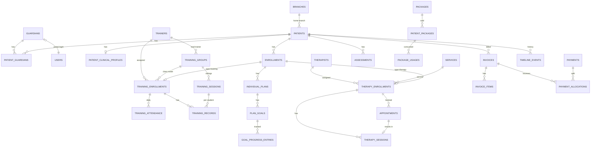

# C-STAR Management System

**Center for Speech Therapy & Autism Rehabilitation (C-STAR), Bangladesh**
Public Website + Center Management System + Parent Portal

> এই README-ই প্রকল্পের **মূল পরিকল্পনা ও অগ্রগতির document** (বাংলা)। প্রতিটি কাজ শেষ হলে নিচের অগ্রগতি তালিকা হালনাগাদ করা হয়।
> সংস্করণ: Plan v2.4 · শেষ হালনাগাদ: ০৭ অক্টোবর ২০২৬ (Sprint ১৭-এর প্রস্তুতি শেষ) · সহযোগী document: [docs/C-STAR-Accounts-BN.md](docs/C-STAR-Accounts-BN.md) (সম্পূর্ণ Accounts Module) · [docs/C-STAR-UAT-BN.md](docs/C-STAR-UAT-BN.md) (UAT চেকলিস্ট) · [Deployment](docs/C-STAR-Deployment-BN.md) · [User Guide](docs/C-STAR-User-Guide-BN.md) · [Go-live পরিকল্পনা](docs/C-STAR-GoLive-Plan-BN.md)

## সূচিপত্র

- [প্রকল্পের কাঠামো](#প্রকল্পের-কাঠামো)
- [Local-এ চালানোর নিয়ম](#local-এ-চালানোর-নিয়ম)
- [কাজের অগ্রগতি](#-কাজের-অগ্রগতি-progress-tracker)
- [মূল ভিত্তি — তিনটি নীতি](#০-মূল-ভিত্তি--তিনটি-নীতি)
- [System Architecture](#১-system-architecture) · [Sitemap](#২-sitemap) · [User Flow](#৩-প্রধান-user-flow)
- [Database](#৪৬-database-design-erd-table-relationship) · [Role ও Permission](#৭-role-ও-permission-matrix) · [API](#৮-rest-api-architecture)
- [Folder Structure](#৯-react-folder-structure) · [UI পরিকল্পনা](#১১১৫-ui-পরিকল্পনা) · [Workflow](#১৬২০-workflow)
- [Security](#২১-security-architecture) · [cPanel Deployment](#২২-cpanel-deployment-architecture) · [Roadmap](#২৩-development-roadmap) · [MVP](#২৪-mvp-scope)
- [Missing Business Logic](#২৬-আমার-চিহ্নিত-missing-business-logic) · [চূড়ান্ত সিদ্ধান্ত](#২৭-চূড়ান্ত-সিদ্ধান্ত--০৬-অক্টোবর-২০২৬--সব-সুপারিশ-অনুমোদিত) · [Accounts Module](#২৮-সম্পূর্ণ-accounts-module-সারসংক্ষেপ)

---

## প্রকল্পের কাঠামো

| Folder | কী আছে |
|---|---|
| `backend/` | Laravel 13 (PHP 8.3): REST API `/api/v1`, Public Website (Blade), Sanctum login, role ও permission |
| `frontend/` | React 19 + TypeScript + Vite + Tailwind: Admin (`/app`), Trainer (`/trainer`), Therapist (`/therapist`), Parent Portal (`/portal`) |
| `docs/` | Accounts Module-এর বিস্তারিত design |

## Local-এ চালানোর নিয়ম

**যা লাগবে:** XAMPP (MariaDB চালু), PHP 8.3, Composer, Node.js 20 বা তার বেশি।

```bash
# ১. Backend (প্রথমবার)
cd backend
composer install
cp .env.example .env             # XAMPP-এর MySQL database "cstar"-এর জন্য আগেই সাজানো
php artisan key:generate
php artisan migrate --seed       # role, permission, branch, service, demo user, demo শিশু ও demo website content
php artisan storage:link         # website-এর ছবি (gallery, team, service) দেখানোর জন্য
npm install && npm run build     # public website-এর CSS/JS (public/build)
php artisan serve                # http://127.0.0.1:8000

# ২. Frontend (আরেকটি terminal-এ)
cd frontend
npm install
npm run dev                      # http://localhost:5173  (/api ও /sanctum Laravel-এ পাঠায়)
```

এরপর browser-এ খুলুন: **http://localhost:5173/login**

### XAMPP দিয়ে চালানো: http://localhost/cstar

Development server ছাড়াই XAMPP-এর Apache দিয়ে পুরো site (website + staff app) দেখা যায়।

| যা সাজানো আছে | বিবরণ |
|---|---|
| `F:\web\htdocs\cstar` | `backend\public` folder-এর **junction** (আলাদা copy নয়) |
| `F:\web\apache\conf\extra\httpd-cstar.conf` | শুধু `/cstar` folder **PHP 8.3** (php-cgi) দিয়ে চলে; htdocs-এর বাকি project আগের মতো PHP 8.2-তে থাকে |
| `F:\web\apache\conf\httpd.conf` | শেষ লাইনে উপরের file `Include` করা। পুরনো config-এর backup: `httpd.conf.bak-before-cstar`, `extra\httpd-xampp.conf.bak-before-cstar` |
| `backend\.env` | `APP_URL=http://localhost/cstar`, `SANCTUM_STATEFUL_DOMAINS`-এ `localhost` ও server-এর IP `103.222.22.107`। **অন্য IP বা domain দিয়ে খুললে সেটাও এই তালিকায় যোগ করতে হবে**, নইলে login-এ "Session store not set on request" দেখায় |

React app-এ পরিবর্তন করলে `/cstar`-এর জন্য আবার build করতে হবে:

```bash
cd frontend && npm run build:xampp     # VITE_APP_BASE=/cstar (.env.xampp)
cd backend  && npm run build           # website-এর CSS/JS
```

> cPanel-এ domain-এর root-এ চালানোর জন্য সাধারণ `npm run build` ব্যবহার করতে হবে (sub-folder ছাড়া)।
> Junction সরাতে: `rmdir F:\web\htdocs\cstar` (শুধু link মোছে, project-এর file নয়)। Apache config ফেরাতে httpd.conf-এর শেষ `Include` লাইনটি মুছে Apache restart করুন।

### Demo login (শুধু local-এর জন্য, সবার password `Cstar@1234`)

| Role | Login | কোথায় যাবে |
|---|---|---|
| Super Admin | admin@cstar.test | /app |
| Branch Admin | branchadmin@cstar.test | /app |
| Receptionist | reception@cstar.test | /app |
| Accountant | accounts@cstar.test | /app |
| Trainer (Md. Hasan) | trainer@cstar.test | /trainer |
| Therapist (Imran Hossain) | therapist@cstar.test | /therapist |
| Parent (Ayan-এর মা) | 01700000007 | /portal |

Demo data-য় plan-এর উদাহরণটাই আছে: **Ayan** (Training + Speech + OT), **Sara** (শুধু Speech Therapy), **Rafi** (শুধু Training)। এছাড়া "Functional Development A" class-এর সময়সূচি (শনি–বৃহস্পতি, সকাল ১০টা–দুপুর ১টা), গত ৩ সপ্তাহের হাজিরা, Ayan-এর ITP (৫টি লক্ষ্য) ও training record, therapist-দের কাজের সময় (Imran: রবি–বৃহঃ বিকাল ৩–৭টা, Farhana: শনি–বুধ সকাল ১০–২টা), Ayan ও Sara-র সাপ্তাহিক therapy slot, গত দুই সপ্তাহের session note, Sara-র therapy plan, আজকের ও সামনের ৪ সপ্তাহের appointment, Ayan-এর Speech & Language assessment (final, অভিভাবকের সাথে share করা, দুটো সুপারিশই enroll হয়ে গেছে), Sara-র assessment (একটি বাকি সুপারিশ: সপ্তাহে ১ বার Occupational Therapy — front desk-এর "Enroll" দেখার জন্য), billing-এর নমুনা (service-এর দাম যেমন Speech ৳১,০০০/session, ৪টি package, ভর্তি ফি ৳২,০০০, training fee ৳৩,৫০০/মাস; Ayan-এর Speech package থেকে session কাটা ও সব পরিশোধিত, Sara-র কিছু বকেয়া, Rafi-র এ মাসের training fee বকেয়া), accounts-এর নমুনা (মাসের ১ তারিখে opening balance: ব্যাংকে ৳৫,০০,০০০, cash ৳১০,০০০, থেরাপি সরঞ্জাম ৳১,৫০,০০০; কয়েকটি খরচ, ৳১৮,৫০০-এর একটি খরচ branch admin-এর অনুমোদনের অপেক্ষায়, মাসিক ভাড়া ৳৪৫,০০০ draft, ব্যাংকে ৳৫,০০০ জমা, receptionist-এর আজকের cash closing), payroll-এর নমুনা (১০ জন staff — চার ধরনের বেতন; নিরাপত্তারক্ষীর ৳৬,০০০ অগ্রিম, মাসে ৳২,০০০ কাটা; গত মাসের বেতন অনুমোদিত ও পরিশোধিত), এবং website-এর নমুনা contact তথ্য (+880 1700-000000, demo ঠিকানা) আছে। **সবই নমুনা — আসল তথ্য পেলে CMS ও admin panel থেকে বদলাতে হবে।**

### Test

```bash
cd backend && php artisan test        # MySQL database "cstar_test" ব্যবহার করে
cd frontend && npx tsc -b && npm run lint
```

### Production build (server-এ Node.js লাগবে না)

cPanel-এর জন্য: `node scripts/build-release.mjs` → `release/cstar-<তারিখ>-<commit>.zip` (`cstar-app/` + `public_html/`)। Server-এ upload করে `php artisan cstar:deploy`, তারপর `php artisan cstar:create-admin`। ধাপে ধাপে: **[docs/C-STAR-Deployment-BN.md](docs/C-STAR-Deployment-BN.md)**। Server-এ **PHP 8.3 বা তার বেশি** লাগবে, Node.js বা Composer লাগবে না। `APP_ENV=production` হলে demo user কখনো তৈরি হয় না।

---

## ✅ কাজের অগ্রগতি (Progress Tracker)

> চিহ্ন: ✅ শেষ · 🔄 চলছে · ⬜ বাকি — **শেষ হালনাগাদ: ০৬ অক্টোবর ২০২৬ (Sprint ১৪ শেষ)**
> প্রতিটি কাজ শেষ হলে এখানে চিহ্ন বদলানো হবে।

### Phase 1 — পরিকল্পনা ও Requirement
| অবস্থা | কাজ | তারিখ / মন্তব্য |
|---|---|---|
| ✅ | Requirement বিশ্লেষণ ও সম্পূর্ণ plan (২৫টি বিষয়) | ০৬ অক্টো ২০২৬ — এই document |
| ✅ | তিনটি মূল নীতি (Patient ≠ Student, Trainer ≠ Therapist, একাধিক Enrollment) architecture-এ বসানো | ০৬ অক্টো ২০২৬ — §০, §৪–৬ |
| ✅ | Missing business logic চিহ্নিত (২০টি) | ০৬ অক্টো ২০২৬ — §২৬ |
| ✅ | সিদ্ধান্ত D1–D8 চূড়ান্ত (সব সুপারিশ অনুমোদিত) | ০৬ অক্টো ২০২৬ — §২৭ |
| ✅ | Local development environment যাচাই (PHP 8.3, Composer, Node 24, MariaDB, Git) | ০৬ অক্টো ২০২৬ |
| ✅ | সম্পূর্ণ Accounts Module design | ০৬ অক্টো ২০২৬ — §২৮ ও [C-STAR-Accounts-BN.md](docs/C-STAR-Accounts-BN.md) |
| ✅ | Accounts সিদ্ধান্ত A1–A9 চূড়ান্ত (সব সুপারিশ অনুমোদিত) | ০৬ অক্টো ২০২৬ — §২৮ |
| ⬜ | Therapist-দের বর্তমান বেতনের পদ্ধতি জানা (A3-এর default ঠিক করতে) | আপনার কাছ থেকে |
| ⬜ | cPanel hosting-এর MySQL/MariaDB version জানা, এবং **PHP 8.3 বা তার বেশি** আছে কিনা নিশ্চিত করা (Laravel 13-এর প্রয়োজন) | আপনার কাছ থেকে |
| ⬜ | Center-এর তথ্য সংগ্রহ (service ও মূল্য, branch, staff, বর্তমান কাগজের form) | আপনার কাছ থেকে |
| ⬜ | Wireframe ও UI/UX design | |

### Development (Roadmap অনুযায়ী — বিস্তারিত §২৩)
| অবস্থা | Sprint | কাজ |
|---|---|---|
| ✅ | ৩ | ERD চূড়ান্ত (§৪–৬); ভিত্তি migration ও seeder: users, branches, rooms, holidays, settings, id_sequences, audit_logs, role/permission — ০৬ অক্টো ২০২৬। *Patient, enrollment ইত্যাদি module-এর table নিজ নিজ sprint-এ তৈরি হবে, যাতে প্রতিটি table তার কাজের সাথে test হয়।* |
| ✅ | ৪ | Laravel 13 + React 19 setup; Sanctum login (email/মোবাইল); ৭টি role ও ৫৯টি permission; branch অনুযায়ী access; Branch, User, Role management (API + UI); audit log; role অনুযায়ী ৪টি app (Admin/Trainer/Therapist/Parent); ৩৫টি backend test পাস — ০৬ অক্টো ২০২৬ |
| ✅ | ৫ | Public Website (Blade) + CMS (basic) + Online Appointment Request — ০৬ অক্টো ২০২৬: SEO-বান্ধব public website (Home, About, Services ও প্রতিটি service-এর page, Therapists, Training, Branches, Gallery, FAQ, Notices, Contact, Appointment), sitemap.xml ও robots.txt; Therapy ও Training আলাদা ভাগে; online appointment form (spam রোধ: লুকানো honeypot field + rate limit) → front desk-এ notification → "Register child" (তথ্য আগে থেকে বসানো) → request স্বয়ংক্রিয়ভাবে converted; contact form; CMS: website settings, service page, team profile, testimonial, FAQ, gallery (অভিভাবকের consent ছাড়া শিশুর ছবি publish হয় না), notice; notification bell; ৭৯টি test পাস। *Contact তথ্য, পরিসংখ্যান, আসল testimonial ও FAQ C-STAR থেকে পেলে CMS-এ বসাতে হবে — demo-তে শুধু নমুনা।* |
| ✅ | ৬ | Patient + Guardian + Documents + **Enrollment System** — ০৬ অক্টো ২০২৬: patient registration (স্বয়ংক্রিয় ID `CSTAR-2026-00001`, duplicate সতর্কবার্তা, ভাই-বোনের জন্য একই guardian, consent), clinical তথ্য আলাদা ও সুরক্ষিত, private document ও ছবি, parent portal login তৈরি, enrollment (Training: class + trainer, Therapy: service + therapist), hold/resume/complete/discontinue/transfer ও ইতিহাস, patient timeline, global search; trainer/therapist শুধু নিজের শিশুদের দেখেন; ৬৯টি test পাস। *Trainer, therapist, class ও service-এর মূল table এখানেই তৈরি; এদের management page Sprint ৭–৮-এ।* |
| ✅ | ৭ | Class + Trainer + Training Attendance + Training Session/Record + ITP — ০৬ অক্টো ২০২৬: Trainer ও Class management (সাপ্তাহিক সময়সূচি, শনি–বৃহস্পতি), ছুটির calendar; এক tap-এ class-এর হাজিরা (Present/Late/Absent/Leave/Holiday; ছুটির দিনে স্বয়ংক্রিয় Holiday; trainer শেষ ৩ দিন পর্যন্ত বদলাতে পারেন, পুরনো দিন branch admin); মাসিক হাজিরা ও হার = (উপস্থিত + দেরি) ÷ (উপস্থিত + দেরি + অনুপস্থিত); Training Record (activity, ১–৫ তারা, পর্যবেক্ষণ, অভিভাবকের জন্য নোট) — শুধু উপস্থিত শিশুর জন্য, Finalize করলে locked ও timeline-এ যায়; ITP (লক্ষ্য, target, অগ্রগতি %, দৈনিক ১–৫ score); Trainer app: Today, Attendance, Records, My Students; Admin: Classes, Students, Trainers, Training Sessions, Holidays, patient profile-এ Training tab; therapist training record বা ITP লিখতে পারেন না; ৯০টি test পাস। |
| ✅ | ৮ | Therapist + Schedule + Appointment + Therapy Session — ০৬ অক্টো ২০২৬: Therapist management (কোন service দেন, সাপ্তাহিক কাজের সময়, ছুটি); খালি slot হিসাব (সময়সূচি − ছুটি − holiday − বুক করা appointment); appointment বুক (একই therapist বা একই শিশুর একই সময়ে দুটো appointment অসম্ভব — database-ও আটকায়), confirm / check-in / cancel (কারণ বাধ্যতামূলক, ২৪ ঘণ্টার কম আগে হলে late cancellation) / no-show / reschedule; therapy enrollment-এর সাপ্তাহিক slot থেকে পরের ৪ সপ্তাহের appointment স্বয়ংক্রিয় (প্রতিদিন রাত ১টায় + হাতে button); Therapy session note (activity, লক্ষ্যের score, home practice, অভিভাবকের জন্য summary বাধ্যতামূলক) — শুধু চিকিৎসা দেওয়া therapist লিখতে পারেন, finalize করলে locked ও appointment completed; therapy plan; Therapist app (Today, Schedule, Patients, Sessions, Session note); Admin: Therapists, Appointments board, Therapy Sessions, patient profile-এ Therapy tab, online request থেকে সরাসরি appointment; ১০৫টি test পাস। |
| ✅ | ৯ | Assessment + Plans/Goals + Timeline + PDF — ০৬ অক্টো ২০২৬: ৭ ধরনের assessment (Speech & Language, Developmental, Autism-related, OT, Communication, Feeding, Other), প্রতিটির নিজস্ব অংশ (যেমন receptive/expressive language, articulation); therapist assessment লেখেন (স্বয়ংক্রিয় নম্বর `ASM-2026-00001`), draft রাখা যায়, summary ছাড়া finalize হয় না, finalize করলে locked, timeline-এ যায় ও assessment appointment completed হয়; শুধু assessment-কারী therapist বদলাতে পারেন; assessment-এ **সুপারিশকৃত programme** (therapy service বা Regular Training, কতবার, অগ্রাধিকার) → front desk patient profile-এর Assessments tab-এ দেখে এক click-এ **Enroll** (form আগে থেকে ভরা, enrollment-এ কোন assessment থেকে এসেছে তা সংরক্ষিত) — receptionist শুধু সুপারিশ দেখেন, clinical findings দেখেন না; final assessment অভিভাবকের সাথে share (parent timeline-এ যায়); **PDF**: assessment report ও progress report (programme, plan-এর লক্ষ্য ও অগ্রগতি bar, session সংখ্যা, assessment) — mPDF দিয়ে, বাংলা যুক্তাক্ষর ঠিকভাবে আসে; Plans/Goals (training ও therapy দুটোতেই) Sprint ৭–৮-এ তৈরি হয়েছিল, এখানে report-এ যুক্ত; Therapist app-এ Assessments (list, নতুন, assessment appointment থেকে "Write assessment"), Admin-এ Assessments page; ১১২টি test পাস। |
| ✅ | ১০ | Package + Invoice + Payment + Due + **Chart of Accounts ও Billing auto-posting** — ০৬ অক্টো ২০২৬: **Chart of Accounts** (৬৭টি খাত, প্রতি branch-এর আলাদা Cash Box, therapy service অনুযায়ী আয়ের খাত), double-entry journal (প্রতিটি entry-তে Debit = Credit যাচাই, posted entry কখনো বদলায় না — শুধু উল্টো entry/reversal; বন্ধ মাসের সংশোধন চলতি মাসে post হয়; fiscal year জুলাই–জুন); **Invoice** (draft → issued → আংশিক/পূর্ণ পরিশোধ, নম্বর `INV-2026-000001`; issue হওয়া invoice কখনো মুছে না, শুধু কারণসহ Void — Void করলে হিসাব উল্টে যায় ও দেওয়া টাকা অগ্রিমে ফেরে); discount-এ কারণ বাধ্যতামূলক, receptionist সর্বোচ্চ ১০% (setting থেকে বদলানো যায়), বেশি হলে branch admin/accountant; **Payment** (Cash/bKash/Nagad/Bank/Card, non-cash হলে transaction ID বাধ্যতামূলক, এক payment একাধিক invoice-এ — পুরনোটা আগে, বাড়তি টাকা **অগ্রিম** হিসেবে থাকে ও পরের invoice-এ নিজে থেকেই কাটা হয়), receipt `RCP-2026-000001` (PDF), refund (শুধু অগ্রিম থেকে), payment void; **Package** (setup, বিক্রি → invoice; টাকা প্রথমে "অনার্জিত আয়" — session হলে তবেই আয় (A2); therapist session note finalize করলেই package থেকে ১ session কাটে; no-show ও ২৪ ঘণ্টার কম আগে cancel-এও কাটে (D3, setting); package শেষ হলে per-session charge; মেয়াদ পেরোলে বাকি টাকা আয়ে যায় — প্রতিদিন রাত ১২:৩০); **স্বয়ংক্রিয় charge:** per-session therapy, assessment fee, প্রতি মাসের ১ তারিখে Regular Training fee (একই মাস দুবার নয়, D4); **Due list**, দিনের **collection** (method ও staff অনুযায়ী; receptionist নিজেরটা দেখেন); প্রতিটি ঘটনার journal entry নিজে থেকেই হয় (Accounts §৩); Admin: Packages, Invoices (+Due list, Training fee), Payments, Accounts (Chart of Accounts ও balance, Journal — শুধু দেখা), patient profile-এ **Billing tab** ও Payment button চালু, Invoice/Receipt PDF; **Dashboard-এর ৯টি card এখন আসল সংখ্যা দেখায়** (role অনুযায়ী); ১২৫টি test পাস। *দাম, package ও fee সব demo — আসল মূল্য তালিকা পেলে Packages page ও Billing settings থেকে বদলাতে হবে।* |
| ✅ | ১১ | **Accounts A** — Expense, Voucher, Cash Closing, Ledger, Trial Balance, P&L, Balance Sheet — ০৬ অক্টো ২০২৬: **Voucher** (Payment PV / Receipt RV / Journal JV / Contra CV, নম্বর `PV-2026-00001`; Debit = Credit না মিললে save হয় না; ধরন অনুযায়ী যাচাই — যেমন Contra শুধু cash/bank/bKash-এর মধ্যে; **Maker-Checker**: ৳৫,০০০ পর্যন্ত (A5, setting) সাথে সাথে post, বেশি হলে প্রস্তুতকারী ছাড়া অন্য কেউ approve/reject করবেন; posted voucher কখনো মুছে না — শুধু reverse); **Expense** (সহজ form: কী বাবদ → কত → কোথা থেকে → bill-এর ছবি; ১৩টি খরচের খাত, প্রতিটি একটি expense account-এর সাথে যুক্ত; system নিজেই Payment Voucher লেখে; receptionist শুধু cash box/petty cash থেকে খরচ লিখতে পারেন; **মাসিক নিয়মিত খরচ** (ভাড়া ইত্যাদি) নির্দিষ্ট দিনে draft হয়ে আসে — প্রতিদিন সকাল ৬টায়); **Cash Closing** (system দেখায় আজ কোন method-এ কত নেওয়া হয়েছে ও cash খরচ; নোট গুনে লেখা; কম/বেশি হলে কারণ বাধ্যতামূলক; অন্য কেউ (branch admin/accountant) cash গ্রহণ করলে পার্থক্য "Cash Short/Over" খাতে post; close করার পর ওই দিনের payment শুধু accountant বদলাতে পারেন); **মাস বন্ধ (Period Lock)** — মাস শেষ হলে তবেই, আগের মাস আগে; বন্ধ মাসে নতুন voucher/খরচ হয় না; কারণসহ reopen; **Financial Reports** (Profit & Loss, Balance Sheet — সম্পদ = দায় + মূলধন যাচাই, Trial Balance, Ledger / Cash Book / Bank ও bKash Book — running balance সহ, Day Book; সব PDF); **Accounts Dashboard** (cash/bank/bKash/Nagad balance, এ মাসের আয়-খরচ-লাভ, ৬ মাসের chart, অনুমোদনের অপেক্ষায় voucher ও গ্রহণ বাকি cash); Chart of Accounts-এ নতুন খাত যোগ; sidebar-এ আলাদা "Accounts" অংশ; ১৩৪টি test পাস। *Opening balance, খরচ ও ভাড়া সব demo — go-live-এর দিন আসল opening balance একটি Journal Voucher দিয়ে লিখতে হবে (A9)।* |
| ✅ | ১২ | **Accounts B** — Employee, Payroll, Therapist Payout, Advance, Payslip — ০৬ অক্টো ২০২৬: **Employee** (সব staff — therapist, trainer, অফিস, আয়া/নিরাপত্তারক্ষী/পরিচ্ছন্নতাকর্মী (A4); নম্বর `EMP-2026-001`; therapist/trainer profile ও login-এর সাথে যুক্ত করা যায় — Trainer ≠ Therapist ঠিক থাকে); **বেতনের ধরন** চারটি (A3): মাসিক নির্দিষ্ট, per-session, মিশ্র (নির্দিষ্ট বেতনে প্রথম N session, বাকিগুলোর আলাদা পারিশ্রমিক), revenue share (session থেকে আসা আসল আয়ের %); বেতনের কাঠামো (basic, বাড়িভাড়া, চিকিৎসা, যাতায়াত, অন্যান্য) তারিখ থেকে কার্যকর — বেতন বাড়লে নতুন কাঠামো, পুরনো payslip অপরিবর্তিত; service অনুযায়ী session-এর হার; **Therapist payout সরাসরি finalized therapy session থেকে** — therapist ও accountant-এর হিসাবে অমিল হয় না; মাসের মাঝে যোগ দিলে/ছেড়ে গেলে দিনের অনুপাতে; **Advance** (দেওয়া → Staff Advances; মাসিক কিস্তিতে বেতন থেকে কাটা); **Payroll run** (মাসিক বেতন ও উৎসব bonus — bonus = এক মাসের basic): system হিসাব → accountant প্রতি জনের bonus/অনুপস্থিতি/tax/অন্যান্য সমন্বয় → **অন্য কেউ (branch admin) অনুমোদন** = হিসাবে post (বিভাগ অনুযায়ী বেতন খরচ, session পারিশ্রমিক, Salary Payable, Staff Advances, Tax Payable) → সবাইকে বা বাছাই করে ব্যাংক/cash/bKash থেকে পরিশোধ; ভুল হলে পরিশোধের আগে কারণসহ reopen (হিসাব ও advance ফিরে যায়); **Payslip ও Salary Sheet PDF** (স্বাক্ষরের জায়গাসহ); প্রত্যেক staff নিজের payslip দেখেন (admin panel-এ "My Payslips", trainer ও therapist app-এ); ১৪০টি test পাস। *বেতন ও হার সব demo — আসল বেতন কাঠামো পেলে Employees page থেকে বসাতে হবে।* |
| ✅ | ১৩ | Parent Portal — ০৬ অক্টো ২০২৬: অভিভাবকদের জন্য **বাংলায়** (D7), ফোনে ব্যবহারের উপযোগী, নিচে ৫টি ঘর: **হোম** (সন্তানের প্রোগ্রাম, পরবর্তী appointment, এ মাসের উপস্থিতি %, বকেয়া, নতুন রিপোর্ট, সর্বশেষ নোট ও বাসায় অনুশীলন, সাম্প্রতিক খবর), **সময়সূচি** (ট্রেনিং class-এর সাপ্তাহিক সময়, আসন্ন ও আগের appointment, appointment-এর **অনুরোধ** পাঠানো → রিসেপশনে notification, Online Requests-এ আসে), **অগ্রগতি** (মাসিক উপস্থিতির calendar ও হার, plan-এর লক্ষ্য ও অগ্রগতি bar, therapy session ও training class-এর অভিভাবকের জন্য লেখা নোট, শেয়ার করা assessment রিপোর্ট ও অগ্রগতি রিপোর্ট PDF), **বিল** (বকেয়া, অগ্রিম, package-এর বাকি session, invoice ও রসিদ PDF), **প্রোফাইল** (অভিভাবকের তথ্য, সন্তানের তালিকা, অনুরোধের অবস্থা, পাসওয়ার্ড পরিবর্তন); একাধিক সন্তান থাকলে উপরে সন্তান বাছাই; সন্তানের enrollment অনুযায়ী অংশ দেখায় (ট্রেনিং না থাকলে উপস্থিতি দেখায় না); সংখ্যা ও তারিখ বাংলায়; **নিরাপত্তা:** শুধু নিজের সেই সন্তান যার জন্য "portal access" চালু, শুধু অভিভাবকের জন্য লেখা তথ্য — clinical note, therapist/trainer-এর internal note, draft session, শেয়ার না করা assessment ও draft invoice কখনো portal-এ যায় না (test দিয়ে যাচাই); ১৪৫টি test পাস। |
| ✅ | ১৪ | Reports + Dashboard charts + Notifications — ০৬ অক্টো ২০২৬: **১২টি report** (§২০): Operational (দিনভিত্তিক appointment, finalize না হওয়া session note), Training (class অনুযায়ী উপস্থিতি %, trainer অনুযায়ী record), Therapy (therapist অনুযায়ী session ও no-show %, service-এর ব্যবহার ও আয়), Clinical (programme অনুযায়ী লক্ষ্য অর্জন), Management (নতুন registration ও enrollment-এর ধারা, branch তুলনা), Financial (training বনাম therapy আয়, payment method অনুযায়ী collection, বকেয়ার বয়স ০–৩০/৩১–৬০/৬১–৯০/৯০+); তারিখ ও branch filter, table + chart, **PDF ও Excel (CSV, বাংলা ঠিক থাকে)** export, export audit log-এ; টাকার report শুধু financial permission-এ, সব report নিজের branch-এ সীমিত; **Dashboard:** ৬ মাসের chart (আয়, training বনাম therapy enrollment, নতুন registration, therapy session, training উপস্থিতি %) ও **"Needs attention"** তালিকা (নতুন অনুরোধ, নিশ্চিত না হওয়া appointment, বাকি session note, নবায়নের package, সবচেয়ে বেশি বকেয়া) — role অনুযায়ী; **Notifications:** অভিভাবকের কাছে বাংলায় স্বয়ংক্রিয় বার্তা (নতুন/বাতিল appointment, আগের দিন সন্ধ্যা ৬টায় reminder, নতুন বিল, পেমেন্ট গ্রহণ, রিপোর্ট শেয়ার, package প্রায় শেষ), staff-এর কাছে (voucher ও payroll অনুমোদনের অপেক্ষা — প্রস্তুতকারী নিজে নয়, cash গ্রহণের অপেক্ষা, package নবায়ন, therapist-কে সকাল ৮টায় বাকি note-এর reminder); in-app bell (admin, trainer, therapist ও বাংলায় parent portal) + email (ঠিকানা থাকলে, setting দিয়ে বন্ধ করা যায়); **ঘোষণা পাঠানো** (অভিভাবক / staff / সবাই, branch অনুযায়ী, পাঠানোর আগে কতজন পাবে দেখা যায়, পাঠানোর ইতিহাস); SMS/WhatsApp gateway পরে যুক্ত হবে; ১৫৩টি test পাস। |
| ✅ | ১৫ | **Accounts C** — Vendor/Payables, Bank Reconciliation, Fixed Assets, Budget, Year-end — ০৭ অক্টো ২০২৬: **Vendor ও Payables** (সরবরাহকারীর তালিকা, go-live-এর আগের পাওনা opening balance হিসেবে; vendor bill `VB-2026-00001` — একাধিক খরচ/সম্পদের খাত, due date; পরিশোধ `VP-2026-00001` cash/ব্যাংক/bKash থেকে — পুরনো bill আগে শোধ হয়; শুধু অপরিশোধিত bill কারণসহ void; কত দিন ধরে বকেয়া (০–৩০/৩১–৬০/৬০+)); **Bank Reconciliation** (ব্যাংক statement CSV import, একই অঙ্ক ও ±৫ দিনের মধ্যে স্বয়ংক্রিয় মিল, হাতে মিলানো, ব্যাংক charge বা সুদ এক click-এ হিসাবে post; বইয়ের balance, outstanding ও পার্থক্য দেখায় — পার্থক্য ০ হলে তবেই complete); **Fixed Assets** (`FA-2026-001`, কেনার তারিখ, দাম, আয়ুষ্কাল ও residual value; ব্যাংক/cash থেকে কেনা বা go-live-এর আগের সম্পদ; মাসিক straight-line **depreciation** — বাদ পড়া মাসগুলোসহ এক entry-তে; বিক্রি/বাতিল করলে লাভ বা ক্ষতি নিজে থেকে post); **Budget** (বছরের, খাত অনুযায়ী মাসিক ভাগ, **Budget বনাম আসল** — কত % খরচ হয়েছে); **Cash Flow statement** (operating / investing / financing, PDF); **Year-end closing** (১২ মাস বন্ধ হলে তবেই; আয়-ব্যয়ের balance branch অনুযায়ী Retained Earnings-এ যায়; closing-এর পরও সেই বছরের P&L দেখা যায়); Periods page-এ বছর বাছাই; ১৫৮টি test পাস। *Vendor, সম্পদ, budget ও ব্যাংক statement সব demo।* |
| ✅ | ১৬ | Security hardening, Testing, UAT + **পূর্ণ Admin menu (§২)** — ০৭ অক্টো ২০২৬: **Menu:** আপনার দেওয়া কাঠামো অনুযায়ী ১৭টি অংশ, খোলা/বন্ধ করা যায়, "Find a page…" দিয়ে খোঁজা, permission অনুযায়ী দেখায়, menu থেকে সরাসরি filter/tab (যেমন Payment Vouchers, Expiring Packages, Session Notes); **১৪৬টি link-এর প্রতিটি browser দিয়ে খুলে যাচাই — কোনো ত্রুটি নেই**। **নতুন page:** Appointments (All, Calendar — মাস/সপ্তাহ, Check-in / Queue — নিজে থেকে হালনাগাদ), Patients (Guardians, Documents, Consents — consent ছাড়া শিশুর তালিকা, Patient Timeline), Training (Dashboard, Schedules, Attendance, Sessions, Activities, ITP), Therapy (Dashboard, Services — দাম ও সময়, Therapist Schedule — সপ্তাহ, ছুটি ও বুকিং, Home Programs, Progress Reports), Assessments (New, Types, Templates — লেখা finding থাকলে section মোছা যায় না, Recommendations), Enrollments (সব, ধরন/অবস্থা অনুযায়ী, Transfer History), Packages (Package Usage, Expiring), Billing (Dashboard, Receipts, Refunds, Payment Allocations, Discounts), Accounts (Bills / Payables, Employee Advances, Bank Accounts — নতুন ব্যাংক/বিকাশ হিসাব যোগ), Staff (Employee Profiles, Salary Structures, **Leave / Absence** — therapist-এর ছুটি দিলে ওই দিন booking বন্ধ, Staff Assignments), Branches (Rooms, Services by Branch, Staff by Branch), Reports (Patients, Enrollments, Assessments, Staff workload — PDF/Excel), Website / CMS (Dashboard, Pages — menu ও Google-এ শিরোনাম, Page Sections — home page-এর অংশের ক্রম ও লুকানো, Branches, SEO — পরীক্ষার সময় search engine থেকে লুকানো, Search Console, Analytics), Notifications (Notification Center, **Templates** — অভিভাবকের বাংলা বার্তার লেখা বদলানো যায়, Logs), Users (Permission matrix, Branch Access), **Activity Logs** (System, Login History, Patient Activity, Clinical Access, Audit — CSV), **Settings** (General, Center Information — সব PDF-এ, Patient ID format, Appointment — late cancel ঘণ্টা ও কত সপ্তাহ আগে বুক, PDF — কাগজ/রং/footer, Security, Backup, System — go-live checklist)। **Security (§২১):** security header, idle timeout ও মেয়াদ শেষে নিজে থেকে login page, password নিয়ম ও login-চেষ্টার সীমা Settings থেকে, প্রতিটি API route-এ sign-in লাগে তা test দিয়ে পাহারা, প্রতিদিন database backup (restore করে যাচাই), composer/npm audit — কোনো দুর্বলতা নেই। **UAT:** [docs/C-STAR-UAT-BN.md](docs/C-STAR-UAT-BN.md) — role অনুযায়ী ৬০টি পরীক্ষা, সমস্যার তালিকা ও sign-off; **আপনার team-এর পরীক্ষা ও স্বাক্ষর বাকি**। ১৮৪টি test পাস। |
| 🔄 | ১৭ | cPanel deployment, staff training, go-live — ০৭ অক্টো ২০২৬ (প্রস্তুতি শেষ, server ও staff-এর অপেক্ষায়): ✅ **Release package** — `node scripts/build-release.mjs` একটি zip বানায় (`cstar-app/` public_html-এর বাইরে + `public_html/`), server-এ Node/Composer লাগে না; ✅ **`php artisan cstar:deploy`** — server পরীক্ষা (PHP 8.3, extension, লেখার অনুমতি, database), APP_KEY, migrate, প্রথমবার পুরো seed, পরে শুধু নতুন তথ্য (বদলানো role, website-এর লেখা, settings অক্ষত — test করা), cache, storage link, go-live checklist; ✅ **`php artisan cstar:go-live-check`**; ✅ live address https হলে http থেকে নিজে https-এ; ✅ email এখন queue-তে (mail server ধীর/বন্ধ হলেও booking/পেমেন্ট আটকায় না; cron প্রতি মিনিটে পাঠায়); ✅ **Settings → Go-live:** opening balance (A9 — একবারে, আবার দিলে আগেরটা reverse) ও **বর্তমান শিশুদের CSV import** (আগে "Check file", বাংলা লেখা/সংখ্যা ও Excel-এর হারানো শূন্য বোঝে, ভাইবোনের অভিভাবক একবারই, আগের বকেয়া "Previous dues" বিল — আয় নয়); ✅ **পুরো go-live মহড়া:** zip থেকে আলাদা folder-এ "cPanel" বসিয়ে install → update → browser-এ opening balance ও import → Balance Sheet balanced; ✅ document: [Deployment গাইড](docs/C-STAR-Deployment-BN.md), [Staff User Guide](docs/C-STAR-User-Guide-BN.md) (button-এর নাম screen-এর সাথে মিলিয়ে), [Go-live ও প্রশিক্ষণ পরিকল্পনা](docs/C-STAR-GoLive-Plan-BN.md); ১৮৭টি test পাস। ⬜ **বাকি (আপনার দিক থেকে):** UAT sign-off · domain ও cPanel hosting (PHP 8.3) · server-এ install · center-এর আসল তথ্য · staff প্রশিক্ষণ · go-live দিন |
| ✅ | ১৮ | **SMS ও WhatsApp** — ০৭ অক্টো ২০২৬: **GreenWeb BulkSMS** দিয়ে অভিভাবকের বার্তা SMS-এ (নতুন/বাতিল appointment, আগের দিনের reminder, নতুন বিল, পেমেন্ট, রিপোর্ট, package, ঘোষণা) — portal-এর বাংলা লেখাই, শুরুতে "C-STAR:"; কোন বার্তা SMS-এ যাবে Settings থেকে টিক; staff-এর বার্তা চাইলে; **WhatsApp** (Meta Cloud API, অনুমোদিত template) ঐচ্ছিক; **Settings → SMS & WhatsApp:** token (encrypted, screen-এ কখনো দেখায় না), balance, পরীক্ষার SMS, "Test mode" (কিছুই পাঠায় না — gateway ছাড়াই পুরো পরীক্ষা); **SMS / WhatsApp Log:** প্রতিটি SMS, কত part (বাংলা ৭০ অক্ষরে ১টি), ফল, ব্যর্থ হলে কারণ ও **Send again**, মাসের খরচের হিসাব; SMS queue-তে যায় — gateway ধীর হলেও কাজ আটকায় না; go-live checklist-এ SMS; ১৯১টি test পাস। *GreenWeb token পেলে Settings-এ বসিয়ে Send test দিলেই চালু।* |
| 🔄 | ১৯ | **অনলাইন পেমেন্ট** — অভিভাবক portal থেকে bKash / SSLCommerz (card, Nagad, Rocket, ব্যাংক) দিয়ে বিল পরিশোধ; টাকা নিজে থেকে হিসাবে post ও রসিদ; sandbox দিয়ে তৈরি, merchant account পেলে চালু |
| ⬜ | ২০ | **আরও সুবিধা (code-only)** — অভিভাবক নিজে খালি slot-এ appointment বুক, waiting list, home program-এ অভিভাবকের feedback, staff-এর হাজিরা, অগ্রগতির chart, therapy সরঞ্জাম/স্টোরের inventory |

---

## ০. মূল ভিত্তি — তিনটি নীতি

এই পুরো system তিনটি নীতির উপর দাঁড়িয়ে আছে। Database, API, UI, permission — সব জায়গায় এগুলো মেনে চলা হবে।

### নীতি ১: Patient ≠ Student

- সব শিশু/ক্লায়েন্ট প্রথমে একটি **Patient** profile। এটাই একমাত্র "মানুষ"-এর table।
- **"Student" আলাদা কোনো table নয়।** একজন patient তখনই "Student", যখন তার একটি **active Training Enrollment** আছে।
- Training enrollment শেষ হলে সে আর student নয়, কিন্তু patient থেকেই যায় (তার সব history সহ)।
- UI-তে "Regular Student / Therapy Patient / Student + Therapy" — এই label **enrollment দেখে স্বয়ংক্রিয়ভাবে হিসাব হবে**, কেউ হাতে বসাবে না।

| Active enrollment | UI-তে দেখাবে |
|---|---|
| শুধু Training | Regular Student |
| শুধু Therapy | Therapy Patient |
| Training + Therapy | Student + Therapy |
| কোনোটাই নেই | Registered (Enrollment নেই) |

### নীতি ২: Trainer ≠ Therapist

| | Trainer | Therapist |
|---|---|---|
| কাজ | Regular student-কে physical/functional training (motor, daily living, social, learning) | Speech, OT, ABA, OPT, Special Education ইত্যাদি therapy session |
| কোথায় যুক্ত | শুধু **Training Enrollment** ও Class-এ | শুধু **Therapy Enrollment** ও Appointment-এ |
| যা লেখে | Training Record, Attendance | Therapy Session Note, Assessment, Home Program |
| Database | `trainers` table | `therapists` table |
| Login role | Trainer | Therapist |
| Dashboard | Today's Class / Students | Today's Appointments |

Trainer কখনো therapy enrollment-এ বসানো যাবে না, therapist কখনো class-এ — এটা database structure দিয়েই আটকানো থাকবে (field-গুলো আলাদা table-এ)।

### নীতি ৩: একজন Patient-এর একাধিক Enrollment

```
PATIENT (একজন শিশু — একটি profile)
   │
   └── ENROLLMENTS (০ বা একাধিক)
         ├── Training Enrollment  → Class + Trainer  → Attendance + Training Record
         └── Therapy Enrollment   → Service + Therapist → Appointment + Therapy Session
```

উদাহরণ:

| Patient | Enrollment ১ | Enrollment ২ | Enrollment ৩ | UI label |
|---|---|---|---|---|
| Ayan | Regular Training (Functional Development A, Trainer: Hasan) | Speech Therapy (Therapist: Imran) | Occupational Therapy (Therapist: Farhana) | Student + Therapy |
| Sara | Speech Therapy | — | — | Therapy Patient |
| Rafi | Regular Training | — | — | Regular Student |

আরও দুটি distinction (আগের requirement থেকে) একইভাবে মানা হবে:

- **Training Session ≠ Therapy Session** — আলাদা table, আলাদা form, আলাদা লেখক।
- **Student Attendance ≠ Therapy Appointment** — attendance প্রতিদিনের class উপস্থিতি; appointment হলো therapist-এর সাথে booked slot। কখনো এক table-এ মিশবে না।

---

## ১. System Architecture

```
┌──────────────────────────────────────────────────────────────────┐
│                         ব্যবহারকারী                              │
│  Website Visitor · Admin · Receptionist · Trainer · Therapist   │
│  Accountant · Parent  (Mobile / Tablet / Desktop)                │
└───────────────┬──────────────────────────────────────────────────┘
                │ HTTPS
┌───────────────▼──────────────────────────────────────────────────┐
│  cPanel Shared Hosting (Apache + PHP 8.3 + MySQL)  — Node.js নেই  │
│                                                                  │
│  ┌──────────────────────┐   ┌─────────────────────────────────┐  │
│  │ React Build (static) │   │ Laravel                         │  │
│  │ index.html + assets  │──►│ • REST API /api/v1              │  │
│  │ Admin + Trainer +    │   │ • Public Website (Blade, SEO)   │  │
│  │ Therapist + Parent   │   │ Sanctum · RBAC · Policies       │  │
│  │ (/app /trainer       │   │ Services · Jobs · PDF (mPDF)    │  │
│  │  /therapist /portal) │   │ Notifications · Audit Log       │  │
│  └──────────────────────┘   └──────────────┬──────────────────┘  │
│                                            │                     │
│                               ┌────────────▼─────────┐           │
│                               │ MySQL Database       │           │
│                               └──────────────────────┘           │
│  storage/app/private  → রোগীর document (public-এ নয়)            │
│  cron (প্রতি মিনিট) → schedule:run → queue, reminder, invoice    │
└──────────────────────────────────────────────────────────────────┘
```

**Layer ভাগ:**

| Layer | দায়িত্ব |
|---|---|
| React SPA | UI, routing, form, role অনুযায়ী আলাদা layout (Admin / Trainer / Therapist / Parent / Website) |
| Laravel Controller | শুধু request নেয়, validation (FormRequest), authorization (Policy), Service call, Resource return |
| Service layer | Business logic — যেমন `EnrollmentService`, `AppointmentService`, `BillingService`, `PackageService` |
| Model + Observer | Data, relationship, timeline event লেখা, audit log |
| Jobs / Scheduler | Reminder, monthly training fee invoice, package expiry, recurring appointment তৈরি |

**Authentication:** একই domain-এ `/api` থাকায় Sanctum **SPA cookie authentication** — CORS ঝামেলা নেই, token browser-এ খোলা থাকে না। ভবিষ্যৎ Mobile App-এর জন্য Sanctum token auth পরে চালু করা যাবে।

---

## ২. Sitemap

### Public Website
```
/                       Home
/about                  About C-STAR
/services               Services (দুটি আলাদা ভাগ: Therapy Services | Training Programs)
/services/{slug}        Service Details
/therapists             Therapists
/therapists/{slug}      Therapist Details
/trainers               Trainers
/branches               Branches
/gallery                Gallery
/faq                    FAQ
/contact                Contact
/appointment            Online Appointment Request
/notices                Notices
/login                  Staff / Parent Login
```

### Admin / Staff Panel (`/app`)

০৭ অক্টোবর ২০২৬-এ আপনার দেওয়া পূর্ণ menu অনুযায়ী sidebar নতুন করে সাজানো হয়েছে এবং Sprint ১৬-এ প্রতিটি menu-র page তৈরি হয়েছে। প্রতিটি অংশ খোলা/বন্ধ করা যায়, উপরে "Find a page…" দিয়ে খোঁজা যায়, আর প্রত্যেকে শুধু নিজের permission-এর অংশগুলো দেখেন। কোনো menu-তে click করলে page-টি সঠিক tab বা filter বাছাই করা অবস্থায় খোলে (যেমন Payment Vouchers → শুধু PV)।

```
Dashboard
Appointments ─ All Appointments · Today's Appointments · Calendar · Appointment Requests · Check-in / Queue
Patients ─ All Patients · New Patient · Patient Search · Guardians · Documents · Consents · Patient Timeline
           (Profile: Overview, Enrollments, Training, Therapy, Assessments, Billing, Guardians, Documents, Timeline)
Training ─ Training Dashboard · Training Students · Training Groups / Classes · Trainers · Training Schedules ·
           Attendance · Training Sessions · Training Records · Activities · ITP / Training Plans
Therapy ─ Therapy Dashboard · Therapy Patients · Therapists · Therapy Services · Therapist Schedule · Appointments ·
          Therapy Sessions · Session Notes · Assessments · Plans & Goals · Home Programs · Progress Reports
Assessments ─ All Assessments · New Assessment · Assessment Types · Assessment Reports · Recommendations · Assessment Templates
Enrollments ─ All · Training · Therapy · Active · On Hold · Completed · Discontinued · Transfer History
Packages ─ All Packages · Create Package · Patient Packages · Package Usage · Expiring Packages · Package Reports
Billing & Payments ─ Billing Dashboard · Invoices · Payments · Due / Outstanding · Payment Allocations · Receipts ·
                     Discounts / Concessions · Refunds · Billing Reports
Accounts ─ Accounts Dashboard · Chart of Accounts · Journal Entries · Payment / Receipt / Expense Vouchers · Expenses ·
           Vendors · Bills / Payables · Payroll · Employee Advances · Cash Closing · Bank Accounts · Bank Reconciliation ·
           Fixed Assets · Budgets · Fiscal Years · Accounting Periods
Staff ─ All Staff · Trainers · Therapists · Admin Staff · Employee Profiles · Salary Structures · Leave / Absence ·
        Staff Assignments · My Payslips
Branches ─ All Branches · Add Branch · Rooms · Services by Branch · Staff by Branch · Holidays · Branch Settings
Reports & Analytics ─ Dashboard · Patient · Enrollment · Attendance · Therapy · Training · Appointment · Assessment ·
                      Progress · Billing · Payment / Due · Accounts · Staff · Branch Reports · Export PDF / Excel
Website / CMS ─ Website Dashboard · Pages · Page Sections · Services · Team Members · Branches · Gallery · Testimonials ·
                FAQ · Notices & Updates · Appointment Requests · Contact Messages · SEO Settings
Notifications ─ Notification Center · Announcements · Templates · Notification Logs · Notification Settings
Users ─ All Users · Add User · Roles · Permissions · Branch Access
Activity Logs ─ System Activity · Login History · Patient Activity · Clinical Access Logs · Audit Logs
Settings ─ General · Center Information · Branch · Patient ID · Appointment · Billing · Accounts · Notification ·
           Language · PDF · Security · Backup · System
```

### Trainer (`/trainer`) — mobile-first
```
Today · My Classes · My Students · Attendance · Training Records · Plans/Goals · Profile
```

### Therapist (`/therapist`) — mobile/tablet-first
```
Today · Appointments · My Patients · Session Notes · Assessments · Plans/Goals · Home Programs · Schedule · Profile
```

### Parent Portal (`/portal`) — mobile-first, bottom navigation
```
Home · My Children → (Child) → Appointments · Training Schedule · Attendance ·
Therapy Sessions · Progress · Reports · Home Program · Billing · Notifications · Profile
```

---

## ৩. প্রধান User Flow

### ৩.১ সম্পূর্ণ Patient Journey
```
Website request / Walk-in / Phone
   ↓
Patient Registration  (+ Guardian, + Consent)
   ↓
Assessment  →  Recommendation (কোন service লাগবে)
   ↓
Enrollment নির্বাচন (একাধিক হতে পারে)
   ├── Regular Training → Class → Trainer → Attendance → Training Record → Training Progress
   └── Therapy → Service → Therapist → (Package) → Appointment → Therapy Session → Therapy Progress
   ↓
Billing (Invoice → Payment → Due)
   ↓
Parent Portal (child-এর enrollment অনুযায়ী dynamic)
   ↓
Progress Report / Review → Continue / Change / Discharge
```

### ৩.২ Receptionist (দ্রুত workflow)
`Search (নাম/ID/ফোন) → Patient Profile → [+ New Enrollment] → [+ Appointment] → [+ Payment]`
Profile page-এর উপরেই এই চারটি quick action button থাকবে — কোনো menu ঘুরতে হবে না।

### ৩.৩ Trainer
`Login → Today (আজকের class) → Attendance এক tap-এ → Student → Training Record → Save`

### ৩.৪ Therapist
`Login → Today's Appointments → Patient → Session Note (আগের note-এর next plan আগে থেকে দেখাবে) → Save/Finalize`

### ৩.৫ Parent
`Login (ফোন নম্বর + password) → Child নির্বাচন → Appointment / Progress / Report / Due`

---

## ৪–৬. Database Design (ERD, Table, Relationship)

### ৪.১ মূল ERD (সংক্ষিপ্ত)



### ৪.২ Requirement-এর table list থেকে যা পরিবর্তন করা হয়েছে (এবং কেন)

| আপনার প্রস্তাব | আমার প্রস্তাব | কারণ |
|---|---|---|
| `classes` | `training_groups` (UI-তে "Class") | PHP-তে `class` reserved word — `Class` নামে Model বানানো যায় না |
| `class_students` | বাদ — `training_enrollments.training_group_id` | একই তথ্য দুই জায়গায় রাখলে mismatch হয়। Class roster = ওই class-এর active training enrollment |
| `therapy_types` | বাদ — `services.category = therapy` | Website, booking, enrollment, package, invoice — সব এক `services` table ব্যবহার করবে |
| `training_programs` | `services.category = training` | একই কারণ |
| `roles, permissions, role_user` | `spatie/laravel-permission` package-এর table | পরীক্ষিত package, shared hosting-এ চলে |
| `progress_records` | `goal_progress_entries` + `progress_reports` + `timeline_events` | দৈনিক progress, আনুষ্ঠানিক report ও timeline আলাদা কাজ |
| `training_goals` | `individual_plans` + `plan_goals` (enrollment-এর অধীনে) | Training ও Therapy দুই ধরনের plan-ই একই structure, কিন্তু enrollment দিয়ে আলাদা থাকে |
| (ছিল না) | `appointment_requests` | Website visitor এখনো patient নয় — আগে request, reception যাচাই করে patient + appointment বানাবে |
| (ছিল না) | `patient_clinical_profiles` | Diagnosis/medical history আলাদা table-এ রাখলে access control সহজ ও নিরাপদ |

### ৫. Table Structure (domain অনুযায়ী)

> সব table-এ `id`, `created_at`, `updated_at`। গুরুত্বপূর্ণ table-এ `deleted_at` (soft delete), `created_by`। টাকা `DECIMAL(12,2)`, timezone `Asia/Dhaka`।

#### (ক) User, Role, Branch, System
| Table | মূল field |
|---|---|
| `users` | name, email (nullable, unique), phone (unique), password, user_type (staff/parent), status, last_login_at, must_change_password |
| spatie tables | `roles`, `permissions`, `model_has_roles`, `model_has_permissions`, `role_has_permissions` |
| `branch_user` | user_id, branch_id, is_primary — staff কোন branch দেখতে পারবে |
| `branches` | code (DHK/CTG), name, slug, address, phone, email, map_url, opening_hours (json), is_active, show_on_website |
| `rooms` | branch_id, name, type (class/therapy/assessment), capacity |
| `holidays` | branch_id (null = সব branch), date, title, type (weekly/public/center) |
| `settings` | group, key, value |
| `id_sequences` | key (patient/invoice/receipt), year, last_value — ID generation (row lock দিয়ে) |
| `audit_logs` | user_id, action (create/update/delete/view/export/login), auditable_type/id, old_values, new_values, ip, user_agent |

#### (খ) Staff
| Table | মূল field |
|---|---|
| `trainers` | user_id, employee_code, name, slug, photo, phone, email, qualification, experience_years, bio, branch_id, joining_date, status, show_on_website |
| `therapists` | user_id, employee_code, name, slug, designation, therapist_type (slt/ot/aba/opt/special_educator/other), photo, qualification, experience_years, bio, primary_branch_id, status, show_on_website |
| `specializations` | name, applies_to (trainer/therapist) |
| `trainer_specialization`, `therapist_specialization` | pivot |
| `therapist_services` | therapist_id, service_id — কোন therapist কোন service দেন (booking-এ filter) |
| `therapist_schedules` | therapist_id, branch_id, weekday, start_time, end_time, slot_minutes, room_id, effective_from/to |
| `therapist_leaves` | therapist_id, start_at, end_at, reason, status |

#### (গ) Service ও Lookup
| Table | মূল field |
|---|---|
| `services` | category (therapy/training/assessment/consultation), name, name_bn, slug, short_description, description, icon, image, default_duration_min, default_price, is_bookable_online, show_on_website, status |
| `branch_services` | branch_id, service_id, price, is_available — branch অনুযায়ী মূল্য |
| `activity_types` | name, domain (fine motor/gross motor/daily living/communication/social/cognitive/physical/functional), applies_to (training/therapy/both) |
| `assessment_types` | name, service_id, template (json) |
| `diagnoses` | name (ASD, ADHD, CP, Down Syndrome, Speech Delay, ID…) |

#### (ঘ) Patient ও Guardian
| Table | মূল field |
|---|---|
| `patients` | patient_code (**CSTAR-2026-00001**), name, name_bn, photo, date_of_birth (বয়স হিসাব হবে, store হবে না), gender, father_name, mother_name, phone, email, address, emergency_contact_name/phone/relation, referral_source, registration_date, home_branch_id, status (active/on_hold/discharged/inactive), notes, photo_consent |
| `patient_clinical_profiles` (1:1) | diagnosis_notes, medical_history, developmental_history, previous_therapy, medications, allergies, school_info |
| `patient_diagnoses` | patient_id, diagnosis_id, diagnosed_by, diagnosed_on, notes |
| `guardians` | user_id (portal login), name, phone, alt_phone, email, occupation, nid, address |
| `patient_guardians` | patient_id, guardian_id, relationship, is_primary, is_emergency_contact, can_access_portal |
| `patient_documents` | patient_id, category, title, path (**private disk**), mime, size, uploaded_by, visible_to_parent |
| `consents` | patient_id, guardian_id, type (treatment/photo_media/data_sharing), granted, signed_at, document_id |

#### (ঙ) Enrollment — system-এর হৃদয়
| Table | মূল field |
|---|---|
| `enrollments` (base) | enrollment_code, patient_id, branch_id, **type (training/therapy)**, status (pending/active/on_hold/completed/discontinued), start_date, end_date, end_reason, source_assessment_id, notes |
| `training_enrollments` (1:1) | enrollment_id (PK), **training_group_id NOT NULL**, **trainer_id NOT NULL**, monthly_fee, notes |
| `therapy_enrollments` (1:1) | enrollment_id (PK), **service_id NOT NULL**, **therapist_id NOT NULL**, sessions_per_week, session_duration_min, billing_mode (package/per_session/monthly) |
| `therapy_enrollment_slots` | therapy_enrollment_id, weekday, start_time, duration_min, room_id — নিয়মিত সাপ্তাহিক slot (যেমন রবি ও মঙ্গল ৪টা) |
| `enrollment_assignments` | enrollment_id, staff_role (trainer/therapist), staff_id, training_group_id, from_date, to_date, reason — trainer/therapist/class বদলের ইতিহাস |

> **কেন এই design:** "Regular Training-এ Class ও Trainer required, Therapy-তে Service ও Therapist required" — এই নিয়ম database নিজেই `NOT NULL` দিয়ে নিশ্চিত করে। ভবিষ্যতে নতুন enrollment type (যেমন Day Care, Online Program) এলে শুধু একটি নতুন extension table যোগ করলেই হবে।

#### (চ) Training Module
| Table | মূল field |
|---|---|
| `training_groups` ("Class") | code, name, branch_id, lead_trainer_id, room_id, start_date, end_date, max_students, status, notes |
| `training_group_trainers` | training_group_id, trainer_id, role (lead/assistant/substitute), from/to |
| `training_group_schedules` | training_group_id, weekday, start_time, end_time |
| `training_group_services` | কোন training program এই class-এ |
| `training_attendance` | training_enrollment_id, patient_id, training_group_id, date, status (present/absent/late/leave/holiday), arrival_time, remarks, marked_by — **unique(training_enrollment_id, date)** |
| `training_sessions` | training_group_id, trainer_id, branch_id, date, start_time, end_time, theme, status (planned/conducted/cancelled) — একটি class-এর একদিনের বসা |
| `training_records` | training_session_id, training_enrollment_id, patient_id, trainer_id, date, start/end, duration, goals, observation, performance (১–৫), progress, challenges, trainer_notes (internal), parent_note, next_plan, status (draft/final) |
| `training_record_activities` | training_record_id, activity_type_id, rating, note |

#### (ছ) Therapy Module
| Table | মূল field |
|---|---|
| `appointment_requests` | parent_name, child_name, phone, email, child_age, branch_id, service_id, preferred_therapist_id, preferred_date, preferred_time, message, status (new/contacted/converted/rejected/spam), handled_by, appointment_id |
| `appointments` | appointment_code, patient_id, therapy_enrollment_id (nullable — প্রথম assessment-এ enrollment থাকে না), service_id, therapist_id, branch_id, room_id, date, start_time, end_time, type (assessment/therapy/consultation/follow_up), status, source (walk_in/phone/online/recurring), cancel_reason, is_late_cancellation, rescheduled_from_id, confirmed_by/at, checked_in_at |
| `therapy_sessions` | appointment_id (unique), therapy_enrollment_id, patient_id, therapist_id, service_id, date, start/end, duration, goals, activities, observation, patient_response, progress, challenges, home_practice, next_session_plan, therapist_notes (internal), parent_summary, status (draft/finalized), finalized_at |
| `therapy_session_activities` | therapy_session_id, activity_type_id, note |

> **Double booking রোধ:** `appointments`-এ একটি generated column (`active_slot` = cancelled/no_show হলে NULL, নাহলে therapist+date+time) এবং তার উপর UNIQUE index — একই therapist-এর একই সময়ে দুটি appointment database-ই আটকাবে।

#### (জ) Assessment, Plan, Progress
| Table | মূল field |
|---|---|
| `assessments` | assessment_code, patient_id, assessment_type_id, appointment_id, assessor_user_id, branch_id, date, chief_complaint, findings, scores (json), recommendations, therapy_plan_note, status (draft/finalized), shared_with_parent |
| `assessment_recommendations` | assessment_id, service_id, frequency, priority, enrollment_id (convert হলে) |
| `assessment_reports` | assessment_id, version, file_path, generated_by, generated_at |
| `individual_plans` | enrollment_id, patient_id, title, start_date, review_date, status (draft/active/reviewed/closed) — Training enrollment-এর হলে ITP, Therapy-র হলে Therapy Plan |
| `plan_goals` | individual_plan_id, domain, title, target, baseline_level, current_level, activities, measurement, progress_percent, review_date, status (not_started/in_progress/achieved/discontinued) |
| `goal_progress_entries` | plan_goal_id, source_type/source_id (training_record বা therapy_session), date, score, note, recorded_by |
| `progress_reports` | patient_id, enrollment_id, period_start/end, type (monthly/quarterly/discharge), summary, prepared_by, status, shared_with_parent, file_path |
| `home_programs` | patient_id, enrollment_id, created_by, title, instructions, frequency, start/end_date, status, visible_to_parent |
| `timeline_events` | patient_id, event_type, eventable_type/id, title, occurred_at, branch_id, actor_id, visibility (internal/parent) |

#### (ঝ) Package ও Billing
| Table | মূল field |
|---|---|
| `packages` | name, service_id, category, sessions_count, validity_days, price, branch_id, is_active |
| `patient_packages` | patient_id, package_id, enrollment_id, invoice_item_id, total_sessions, used_sessions (cache), price, start_date, expiry_date, status (active/exhausted/expired/cancelled) |
| `package_usages` | patient_package_id, therapy_session_id, appointment_id, reason (session/no_show/late_cancel/adjustment), quantity (+/−), recorded_by — **ledger**, তাই remaining সবসময় যাচাইযোগ্য |
| `invoices` | invoice_no, patient_id, branch_id, guardian_id, issue_date, due_date, subtotal, discount_total, total, paid_total, due_total, status (draft/issued/partially_paid/paid/void), void_reason |
| `invoice_items` | invoice_id, item_type (admission/training_fee/therapy_session/package/assessment/other), service_id, enrollment_id, patient_package_id, therapy_session_id, billing_period (YYYY-MM), description, qty, unit_price, discount, line_total |
| `payments` | receipt_no, patient_id, branch_id, amount, method (cash/bkash/nagad/bank/card), transaction_ref, paid_at, received_by, payer_name, status |
| `payment_allocations` | payment_id, invoice_id, amount — এক payment একাধিক invoice-এ ভাগ করা যায়; অবশিষ্ট = advance |

#### (ঞ) Notification ও CMS
| Table | মূল field |
|---|---|
| `notifications` | Laravel standard (in-app) |
| `notification_templates` | key, channel (sms/email/whatsapp/in_app), language, subject, body |
| `notification_logs` | channel, recipient, template, status, provider_response |
| `notices` | title, body, audience (all/parents/staff/branch), publish_at, expires_at, show_on_website |
| `website_pages` + `page_sections` | slug, meta_title, meta_description, og_image / section_key, content (json), sort, is_visible |
| `gallery_albums`, `gallery_items` | album, image/video, caption, consent_checked |
| `testimonials`, `faqs`, `contact_messages` | — |

### ৬. মূল Relationship সারসংক্ষেপ

| Relationship | ধরন |
|---|---|
| Patient → Enrollments | ১ : অনেক (০ সহ) |
| Enrollment → Training Enrollment / Therapy Enrollment | ১ : ১ (type অনুযায়ী ঠিক একটি) |
| Training Group (Class) → Training Enrollments | ১ : অনেক (= class roster) |
| Trainer → Training Enrollments, Classes | ১ : অনেক |
| Therapist → Therapy Enrollments, Appointments, Therapy Sessions | ১ : অনেক |
| Therapy Enrollment → Appointments → Therapy Session | ১ : অনেক → ১ : ০/১ |
| Training Session → Training Records | ১ : অনেক (প্রতি student একটি) |
| Patient ↔ Guardian | অনেক : অনেক (ভাই-বোন একই guardian শেয়ার করতে পারে) |
| Enrollment → Individual Plan → Goals → Progress Entries | ১ : অনেক : অনেক : অনেক |
| Patient Package → Package Usages ← Therapy Session | ledger |
| Payment ↔ Invoice | অনেক : অনেক (payment_allocations দিয়ে) |

**Derived "Patient Type" query (উদাহরণ):**
```sql
SELECT p.id,
  MAX(e.type='training' AND e.status='active') AS is_student,
  MAX(e.type='therapy'  AND e.status='active') AS has_therapy
FROM patients p LEFT JOIN enrollments e ON e.patient_id = p.id
GROUP BY p.id;
```

---

## ৭. Role ও Permission Matrix

চিহ্ন: **F** = সম্পূর্ণ · **B** = নিজ branch · **A** = শুধু assigned · **O** = শুধু নিজের child · **R** = শুধু দেখা · **—** = নেই

| Module | Super Admin | Branch Admin | Receptionist | Trainer | Therapist | Accountant | Parent |
|---|---|---|---|---|---|---|---|
| Patient demographic | F | B | B (create/edit) | A (R) | A (R) | B (R) | O (R) |
| Patient clinical info | F | B | create at intake | A (R, সীমিত) | A | — | — |
| Guardian | F | B | B | — | A (R) | B (R) | নিজের profile |
| Enrollment | F | B | B (create) | A (R) | A (R) | B (R) | O (R) |
| Class | F | B | B (R) | নিজের class (R) | — | — | — |
| Training Attendance | F | B | B (R) | A (mark) | — | — | O (R) |
| Training Record | F | B (R) | — | A (create/edit) | — | — | O (parent_note শুধু) |
| Appointment | F | B | B (create/confirm) | — | A (R/status) | — | O (R/request) |
| Therapy Session | F | B (R) | — | — | A (create/edit) | — | O (parent_summary শুধু) |
| Assessment | F | B (R) | — | — | A (create) | — | O (shared report) |
| Plans & Goals | F | B (R) | — | A (training) | A (therapy) | — | O (R) |
| Home Program | F | B | — | A | A | — | O (R) |
| Package / Invoice / Payment | F | B | B (basic billing) | — | — | B (F) | O (R) |
| Accounts: Expense / Voucher | F | B (অনুমোদন) | Petty cash | — | — | F | — |
| Accounts: Payroll | F | B (অনুমোদন) | — | নিজের payslip | নিজের payslip | F | — |
| Accounts: Cash Closing | F | B (গ্রহণ) | নিজের | — | — | F | — |
| Financial Statements (P&L, Balance Sheet) | F | B | — | — | — | F | — |
| Discount | F | B (limit সহ) | ছোট limit পর্যন্ত | — | — | B | — |
| Reports | F | B | daily collection | নিজের | নিজের | Financial | — |
| CMS | F | — | — | — | — | — | — |
| Users & Roles, Settings | F | B (staff) | — | — | — | — | — |
| Audit Log | F | B (R) | — | — | — | — | — |

**Record-level scope নিয়ম (Laravel Policy দিয়ে):**
- **Trainer** একজন patient দেখতে পারবে শুধু যদি ওই patient-এর **active training enrollment**-এ সে trainer, অথবা সে ওই class-এর lead/assistant/substitute trainer। Therapy session note সে দেখবে না।
- **Therapist** দেখতে পারবে শুধু যদি তার নামে **active therapy enrollment** বা আসন্ন/চলতি **appointment** আছে। অন্য therapist-এর internal note দেখতে পাবে কিনা — setting দিয়ে নিয়ন্ত্রিত (default: একই patient-এর team হলে summary দেখবে)।
- **Parent** শুধু `patient_guardians`-এ `can_access_portal = true` থাকা child দেখবে। Internal note কখনো নয় — শুধু parent_note / parent_summary / shared report।
- **Branch Admin/Receptionist** — patient-এর home branch অথবা তার branch-এ active enrollment থাকলে।
- পুরোনো trainer/therapist (assignment শেষ) — নতুন data দেখতে পারবে না, নিজের লেখা পুরোনো record দেখতে পারবে।

---

## ৮. REST API Architecture

**Convention:** prefix `/api/v1`, JSON, Laravel API Resource, pagination `?page=&per_page=`, filter `?filter[status]=active`, sort `?sort=-date`। Error format `{ message, errors }`। সব route role/permission middleware + Policy দিয়ে সুরক্ষিত।

```
# Auth
POST   /auth/login            POST /auth/logout        GET /auth/me
POST   /auth/forgot-password  POST /auth/reset-password PUT /auth/password

# Public (auth ছাড়া, rate limited)
GET    /public/services  /public/services/{slug}  /public/therapists  /public/therapists/{slug}
GET    /public/trainers  /public/branches  /public/gallery  /public/testimonials  /public/faqs  /public/pages/{slug}
GET    /public/availability?branch=&service=&therapist=&date=
POST   /public/appointment-requests     POST /public/contact

# Patients
GET|POST       /patients               GET|PUT /patients/{id}
GET            /patients/search?q=     (নাম / ID / ফোন — receptionist quick search)
GET            /patients/{id}/timeline
GET|POST       /patients/{id}/guardians      /patients/{id}/documents   /patients/{id}/consents
GET            /patients/{id}/billing-summary

# Enrollments
GET|POST       /enrollments            GET|PUT /enrollments/{id}
POST           /enrollments/{id}/hold | resume | complete | discontinue | transfer

# Training
GET|POST       /classes                GET|PUT /classes/{id}    GET /classes/{id}/roster
GET|POST       /training-attendance    POST /training-attendance/bulk
GET            /training-attendance/monthly?enrollment=&month=2026-10
GET|POST       /training-sessions      GET|PUT /training-sessions/{id}
GET|POST       /training-records       PUT /training-records/{id}   POST /training-records/{id}/finalize

# Therapy
GET|POST       /therapy-enrollments
GET|POST       /appointment-requests   POST /appointment-requests/{id}/convert
GET|POST       /appointments           PUT /appointments/{id}
POST           /appointments/{id}/confirm | check-in | cancel | no-show | reschedule
GET|POST       /therapy-sessions       PUT /therapy-sessions/{id}   POST /therapy-sessions/{id}/finalize

# Assessment / Plan / Progress
GET|POST       /assessments            PUT /assessments/{id}   GET /assessments/{id}/pdf
GET|POST       /plans                  GET|POST /plans/{id}/goals   POST /goals/{id}/progress
GET|POST       /progress-reports       GET|POST /home-programs

# Billing
GET|POST       /packages               GET|POST /patient-packages
GET|POST       /invoices               POST /invoices/{id}/issue | void   GET /invoices/{id}/pdf
GET|POST       /payments               GET /payments/{id}/receipt
GET            /dues

# Role-specific dashboards
GET            /dashboard/admin   /trainer/today   /therapist/today

# Parent portal (আলাদা namespace, শুধু নিজের child)
GET            /portal/children   /portal/children/{id}
GET            /portal/children/{id}/appointments | attendance | training-records | therapy-sessions
               | progress | reports | home-programs | invoices
POST           /portal/appointment-requests

# Reports (PDF/Excel export: ?format=pdf|xlsx)
GET            /reports/patients | students | attendance | training | therapy | appointments
               | therapists | trainers | branches | revenue | payments | dues | progress | assessments

# Admin
CRUD           /branches /rooms /holidays /services /trainers /therapists /users /roles
CRUD           /cms/pages /cms/gallery /cms/testimonials /cms/faqs /notices
GET            /notifications   POST /notifications/{id}/read   GET /audit-logs
```

---

## ৯. React Folder Structure

```
frontend/
├── src/
│   ├── app/                 # App.tsx, providers (QueryClient, Auth), router
│   ├── routes/              # route definitions + RoleGuard
│   ├── layouts/             # WebsiteLayout, AdminLayout, TrainerLayout, TherapistLayout, ParentLayout
│   ├── components/
│   │   ├── ui/              # Button, Input, Modal, Table, Badge, Card, Tabs, Drawer
│   │   └── shared/          # PatientSearch, DatePicker, StatusBadge, FileUpload, EmptyState
│   ├── features/
│   │   ├── auth/            # api.ts, hooks, pages, components, types (প্রতিটি feature-এ একই pattern)
│   │   ├── dashboard/
│   │   ├── patients/
│   │   ├── enrollments/
│   │   ├── training/        # classes, attendance, training-sessions, records
│   │   ├── trainers/
│   │   ├── therapists/
│   │   ├── therapy/         # therapy-enrollments, therapy-sessions
│   │   ├── appointments/
│   │   ├── assessments/
│   │   ├── plans/
│   │   ├── billing/         # packages, invoices, payments
│   │   ├── portal/          # parent portal
│   │   ├── reports/
│   │   ├── cms/
│   │   └── users/
│   ├── api/                 # axios client (withCredentials, CSRF, interceptors)
│   ├── hooks/               # usePermission, useBranch, useDebounce
│   ├── contexts/            # AuthContext, BranchContext
│   ├── utils/               # date (Asia/Dhaka), currency (৳), age calc
│   ├── types/               # shared TS types
│   └── i18n/                # bn.json, en.json
├── public/  ·  .env.production  ·  vite.config.ts
```
Library: Vite, TypeScript, React Router, Axios, **TanStack Query** (cache/refetch), React Hook Form + Zod, Tailwind CSS, Recharts, react-i18next।

## ১০. Laravel Folder Structure

```
backend/
├── app/
│   ├── Http/
│   │   ├── Controllers/Api/V1/   # Auth, Patient, Enrollment, TrainingGroup, TrainingAttendance,
│   │   │                         # TrainingSession, TrainingRecord, Appointment, TherapySession,
│   │   │                         # Assessment, Invoice, Payment, Report ...
│   │   │   ├── Portal/           # Parent portal controllers
│   │   │   └── Public/           # Website controllers
│   │   ├── Requests/             # FormRequest validation (প্রতিটি action-এর জন্য)
│   │   ├── Resources/            # API Resource (role অনুযায়ী field লুকানো)
│   │   └── Middleware/
│   ├── Models/                   # Patient, Enrollment, TrainingEnrollment, TherapyEnrollment,
│   │                             # TrainingGroup, Trainer, Therapist, Appointment, ...
│   ├── Enums/                    # EnrollmentType, AppointmentStatus, AttendanceStatus, PaymentMethod
│   ├── Policies/                 # PatientPolicy, TrainingRecordPolicy, TherapySessionPolicy ...
│   ├── Services/                 # EnrollmentService, AppointmentService, AvailabilityService,
│   │                             # AttendanceService, PackageService, BillingService,
│   │                             # IdGenerator, TimelineService, ReportService, PdfService
│   ├── Observers/                # timeline event + audit log
│   ├── Notifications/            # AppointmentConfirmed, PaymentReceived, ...
│   ├── Channels/                 # SmsChannel (future), WhatsAppChannel (future)
│   ├── Jobs/                     # SendReminder, GenerateMonthlyTrainingInvoices, ExpirePackages
│   └── Console/                  # scheduled commands
├── database/ migrations · seeders (roles, permissions, services, demo) · factories
├── routes/ api.php · web.php (SPA fallback) · console.php
├── resources/views/pdf/          # Assessment, Invoice, Receipt, Progress report template
└── tests/ Feature (policy ও workflow test) · Unit
```

---

## ১১–১৫. UI পরিকল্পনা

### ১১. Public Website
- **Design:** আধুনিক, পেশাদার, শিশু-বান্ধব; Green + Blue branding; গোলাকার card, নরম illustration; mobile-first।
- **Homepage section ক্রম:** Header (logo, menu, ফোন, "Appointment" button) → Hero (মূল বার্তা + দুটি CTA: Book Appointment / Call Now) → Trust/Statistics (শিশু সংখ্যা, বছর, therapist, branch) → **Therapy Services** → **Training Programs** (আলাদা section) → About C-STAR → Why Choose Us → Therapists → Branches → Testimonials → Gallery → FAQ → Appointment CTA → Contact (map) → Footer।
- **Appointment page:** ধাপে ধাপে form (Branch → Service → Therapist (ঐচ্ছিক) → তারিখ → সময় → তথ্য) — mobile-এ এক screen-এ একটি ধাপ। Submit-এর পর "আমরা শীঘ্রই কল করব" confirmation।
- Floating WhatsApp/Call button, Bangla/English toggle।

### ১২. Admin Dashboard (Modern SaaS)
- বাম sidebar (collapsible), উপরে global patient search + branch selector + notification bell।
- **Stat card:** Total Children · Regular Students · Therapy-only · Student + Therapy · Active Trainers · Active Therapists · আজকের Training Session · আজকের Therapy Session · আজকের Appointment · আজকের Collection · Total Due।
- **Chart:** New Registration (মাসিক), Enrollment (Training vs Therapy), Monthly Revenue, Attendance Rate, Therapy Sessions, Branch Performance।
- **Action list:** নতুন online request, unconfirmed appointment, unfinalized note, মেয়াদ শেষ হওয়া package, বেশি due।
- **Patient Profile:** উপরে header (ছবি, ID, বয়স, label badge, guardian ফোন, due) + quick action (New Enrollment / Appointment / Payment) + tabs।

### ১৩. Trainer Dashboard (সহজ, দ্রুত)
- **Today screen:** আজকের class card (সময়, room, student সংখ্যা) + Present/Absent গণনা + Pending Training Notes।
- **Attendance:** student-এর ছবি সহ list, default "Present", এক tap-এ Absent/Late/Leave — "Save All"।
- **Training Record:** student নির্বাচন → activity chip (Fine Motor, Gross Motor…) tap করে বাছাই → performance ১–৫ star → ছোট note → Save। আগের দিনের next plan উপরে দেখাবে।
- Mobile-এ bottom navigation: Today · Students · Records · Profile।

### ১৪. Therapist Dashboard (Clinical workflow)
- **Today:** সময় অনুযায়ী appointment list (status color), check-in হলে "Start Session"।
- **Session Note screen:** বামে patient summary (diagnosis, active goals, last session-এর next plan, package remaining) ; ডানে structured form (Goals worked → Activities → Observation → Response → Progress → Home Practice → Next Plan) ; Draft auto-save ; Finalize।
- Assessment form (type অনুযায়ী template), Plan/Goal editor, Home Program, নিজের weekly schedule ও leave।
- Tablet-এ দুই column, mobile-এ এক column।

### ১৫. Parent Portal (খুব সহজ, mobile-first)
- Bottom navigation: **Home · Schedule · Progress · Billing · Profile**।
- একাধিক সন্তান থাকলে উপরে child switcher।
- **Dynamic:** child-এর enrollment অনুযায়ী section দেখাবে —
  - Regular Student → Training Schedule, Attendance (মাসিক calendar + rate %), Training Progress
  - Therapy Patient → Appointments, Therapy Sessions (parent summary), Therapy Progress, Home Program
  - দুটোই → দুটো section-ই
- Home card: পরবর্তী appointment, এই মাসের attendance %, due amount, নতুন report।
- Bangla ভাষা default রাখার সুপারিশ।

---

## ১৬–২০. Workflow

### ১৬. Appointment Workflow
```
[Online] Visitor form → appointment_request (New) → Admin notification
   → Receptionist ফোন করে যাচাই → existing patient খোঁজা / নতুন patient তৈরি
   → Appointment তৈরি (Confirmed) → Parent-কে SMS/notification
[Walk-in/Phone] Receptionist → Patient search → Appointment (Confirmed)
[Recurring] Therapy enrollment slot → scheduler আগামী ৪ সপ্তাহের appointment তৈরি করে

Confirmed → (দিনের আগে Reminder) → Checked-in (reception) → Therapist session note
   → Completed (note save হলে স্বয়ংক্রিয়) → Package থেকে ১ session কাটা / invoice item
বিকল্প: Cancelled (কারণ সহ; নির্দিষ্ট সময়ের কম আগে হলে Late Cancel) · No Show · Rescheduled
```
**Availability হিসাব:** therapist schedule (branch, weekday) − ছুটি/leave − holiday − ইতিমধ্যে booked slot।

### ১৭. Training Workflow
```
Assessment → Training Enrollment (Class + Trainer + monthly fee) → ITP তৈরি (goals)
প্রতিদিন: Trainer → Attendance (bulk) → Training Session খোলে
   → উপস্থিত student-দের Training Record (activities, performance, goal score)
   → Goal progress update → Parent note portal-এ
মাসিক: Attendance report (rate %), Training fee invoice (স্বয়ংক্রিয়)
নির্দিষ্ট সময় পর: ITP Review → নতুন goal / Class change / Complete
```
**নিয়ম:** Absent/Leave student-এর training record তৈরি করা যাবে না। Holiday দিনে attendance স্বয়ংক্রিয় "Holiday"।
**Attendance rate** = (Present + Late) ÷ (মোট কার্যদিবস − Holiday − Leave) × ১০০ (Leave বাদ দেওয়া হবে কিনা setting-এ)।

### ১৮. Therapy Workflow
```
Registration → Assessment (Finalized) → Recommendation (যেমন Speech ২/সপ্তাহ, OT ২/সপ্তাহ)
   → প্রতিটি recommendation থেকে Therapy Enrollment (service + therapist + slot)
   → Package বিক্রি (ঐচ্ছিক) → Recurring appointments
   → Session → Session Note (draft → finalize) → goal progress → home practice
   → Package remaining হালনাগাদ → ২ session বাকি থাকলে renewal alert
   → মাসিক/ত্রৈমাসিক Progress Report → Parent-এর সাথে share
   → Continue / Therapist change / Discharge
```

### ১৯. Billing Workflow
```
চার্জের উৎস:
  ├── Registration/Admission fee (একবার)
  ├── Assessment fee
  ├── Training: মাসিক fee (১ তারিখে স্বয়ংক্রিয় invoice; একই মাস দুবার নয়)
  ├── Therapy package (অগ্রিম invoice → patient_package)
  └── Therapy per-session (session complete হলে invoice item)
      ↓
Invoice (Draft → Issued) → Discount (role-ভিত্তিক সীমা, কারণ বাধ্যতামূলক)
      ↓
Payment (Cash/bKash/Nagad/Bank/Card + transaction ref) → এক বা একাধিক invoice-এ allocation
      ↓
Receipt (PDF/print) → Due হালনাগাদ → Parent portal-এ দেখা যাবে
দিন শেষে: Receptionist-ভিত্তিক cash collection report (method অনুযায়ী)
```
**নিয়ম:** Issue হওয়া invoice delete হবে না — শুধু Void (কারণ সহ, audit log)। Training ও Therapy আলাদা invoice item হিসেবে থাকবে, তাই revenue আলাদাভাবে report করা যাবে।

### ২০. Reporting Workflow
```
Report নির্বাচন → Filter (তারিখ, branch, service, trainer/therapist, status)
   → স্ক্রিনে table + chart → Export (PDF / Excel)
```
| ধরন | উদাহরণ |
|---|---|
| Operational | আজকের appointment, attendance sheet, pending notes |
| Clinical | Patient progress, goal achievement, assessment summary |
| Training | Class-wise attendance %, trainer-wise records |
| Therapy | Therapist-wise session, no-show rate, service utilization |
| Financial | Revenue (training vs therapy), payment method, due/aging, daily collection |
| Management | Branch performance, নতুন registration, enrollment trend |

Report শুধু permission অনুযায়ী (accountant → financial, trainer → নিজের)। Export audit log-এ লেখা হবে।

---

## ২১. Security Architecture

| স্তর | ব্যবস্থা |
|---|---|
| Transport | পুরো site HTTPS (cPanel AutoSSL), HSTS |
| Authentication | Sanctum SPA cookie (httpOnly, secure, SameSite), CSRF, login rate limit (৫ বার/মিনিট), দীর্ঘ inactivity-তে logout |
| Authorization | Spatie role/permission (route level) + **Policy (record level)** — নীতি ৭-এর scope নিয়ম |
| Field-level | API Resource role অনুযায়ী clinical/internal field বাদ দেয় |
| Validation | সব input FormRequest দিয়ে; mass-assignment সুরক্ষা |
| File upload | mime + size check, random নাম, **`storage/app/private`** (public URL নেই), signed temporary URL দিয়ে download |
| Rate limiting | Public appointment form ও login-এ throttle + honeypot/captcha |
| Audit | Create/Update/Delete + clinical record **view** + export + login — সব audit_logs-এ |
| Clinical note | Finalize হওয়ার পর edit নয় — শুধু amendment (কারণ সহ) |
| Data | Soft delete, password bcrypt, `.env` public_html-এর বাইরে, `APP_DEBUG=false` |
| Backup | প্রতিদিন database dump (cron) + সাপ্তাহিক file backup, server-এর বাইরে কপি |
| Parent isolation | `/portal` route শুধু `patient_guardians` link দিয়ে query — অন্য child-এর ID দিলে 403/404 |

**Sprint ১৬-এ যা যুক্ত/যাচাই হয়েছে (০৭ অক্টো ২০২৬):**

| বিষয় | ব্যবস্থা |
|---|---|
| Security header | প্রতিটি response-এ `X-Content-Type-Options: nosniff`, `X-Frame-Options: SAMEORIGIN`, `Referrer-Policy`, `Permissions-Policy`; HTTPS হলে HSTS; API response কখনো cache হয় না (`Cache-Control: private, no-store`) |
| Session | Idle timeout Settings → Security থেকে (default ১২০ মিনিট); মেয়াদ শেষ হলে app নিজেই login page-এ নিয়ে যায় — screen-এ কোনো শিশুর তথ্য থেকে যায় না |
| Password | ন্যূনতম দৈর্ঘ্য ও symbol বাধ্যতামূলক কিনা Settings থেকে (সবসময় অক্ষর + সংখ্যা); password বদল audit log-এ |
| Login | মিনিটে কতবার চেষ্টা করা যাবে Settings থেকে (default ৫); Login History-তে ৫+ ব্যর্থ চেষ্টার IP আলাদা দেখায় |
| Activity Logs | System Activity, Login History, Patient Activity (এক শিশুর সব ঘটনা), Clinical Access, Audit Logs — filter ও CSV export (export-ও log হয়); branch admin শুধু নিজের branch |
| Route guard test | একটি test নিশ্চিত করে `/api/v1`-এর login ছাড়া প্রতিটি route-এ sign-in লাগে — নতুন route ভুলে খোলা থাকলে test fail করবে |
| Backup | প্রতিদিন রাত ২:৩০-এ database backup (PHP দিয়ে, mysqldump লাগে না), N দিন রাখা, Super Admin download করতে পারেন (log হয়); restore phpMyAdmin-এ import করে — **নমুনা backup আলাদা database-এ restore করে সব table ও হিসাব মিলিয়ে দেখা হয়েছে** |
| Go-live checklist | Settings → System: debug বন্ধ, production mode, HTTPS, secure cookie, cron চলছে, ২ দিনের মধ্যে backup, demo account নেই, email চালু — কোনটা বাকি তা দেখায় |
| Dependency audit | `composer audit` ও `npm audit` — কোনো জানা দুর্বলতা নেই (০৭ অক্টো ২০২৬) |
| Website | পরীক্ষার সময় "search engine থেকে লুকানো" (robots.txt `Disallow: /` + `noindex`); go-live-এ বন্ধ করতে হবে |

---

## ২২. cPanel Deployment Architecture

```
/home/cstaruser/
├── cstar-app/                 ← Laravel (public_html-এর বাইরে — নিরাপদ)
│   ├── app, config, routes, storage, vendor, .env ...
└── public_html/               ← শুধু public ফাইল
    ├── index.php              ← Laravel public/index.php (path ../cstar-app-এ বদলানো)
    ├── .htaccess              ← /app /trainer /therapist /portal → React index.html; বাকি সব (website, /api) → Laravel
    ├── build/ বা assets/      ← React production build (npm run build-এর output)
    └── storage → symlink (শুধু public media; patient document নয়)
```
**ধাপ:**
1. Local/CI-তে: `composer install --no-dev -o` এবং `npm run build` (React)।
2. ফাইল upload (Git Version Control / FTP / zip) — server-এ Node.js লাগবে না।
3. cPanel-এ MySQL database + user, PHP 8.3 নির্বাচন (MultiPHP), `.env` সেট।
4. `php artisan migrate --force`, `config:cache`, `route:cache`, `storage:link` (SSH বা cPanel Terminal; না থাকলে একবারের জন্য সুরক্ষিত deploy route)।
5. **Cron:** `* * * * * php /home/cstaruser/cstar-app/artisan schedule:run` — এর মধ্যেই `queue:work --stop-when-empty`, reminder, monthly invoice, backup।
6. AutoSSL চালু, HTTP → HTTPS redirect।

---

## ২৩. Development Roadmap

| Sprint (আনুমানিক) | কাজ |
|---|---|
| ১ (সপ্তাহ ১) | Requirement চূড়ান্ত, নিচের "সিদ্ধান্ত" অংশ নিশ্চিত, wireframe |
| ২ (সপ্তাহ ২–৩) | UI/UX design (Website + Admin + Trainer + Therapist + Parent), design system |
| ৩ (সপ্তাহ ৩) | ERD চূড়ান্ত, migration লেখা, seeder |
| ৪ (সপ্তাহ ৪) | Laravel setup, Auth, Roles, Branch, Users |
| ৫ (সপ্তাহ ৫–৬) | Public Website + CMS (basic) + Online Appointment Request |
| ৬ (সপ্তাহ ৬–৭) | Patient + Guardian + Documents + **Enrollment System** |
| ৭ (সপ্তাহ ৮–৯) | Class + Trainer + Training Attendance + Training Session/Record + ITP |
| ৮ (সপ্তাহ ১০–১১) | Therapist + Schedule + Appointment + Therapy Session |
| ৯ (সপ্তাহ ১২) | Assessment + Plans/Goals + Timeline + PDF |
| ১০ (সপ্তাহ ১৩–১৫) | Package + Invoice + Payment + Due + **Chart of Accounts, journal, Billing auto-posting** |
| ১১ (সপ্তাহ ১৬–১৭) | **Accounts A** — Expense, Voucher (approval), Cash Closing, Petty Cash, Cash/Bank Book, Ledger, Trial Balance, P&L, Balance Sheet, Period Lock |
| ১২ (সপ্তাহ ১৮–১৯) | **Accounts B** — Employee, Salary setup, Payroll, Therapist session payout, Advance, Payslip |
| ১৩ (সপ্তাহ ২০) | Parent Portal |
| ১৪ (সপ্তাহ ২১) | Reports + Dashboard charts + Notifications (in-app/email) |
| ১৫ (সপ্তাহ ২২) | **Accounts C** — Vendor/Payables, Bank Reconciliation, Fixed Assets, Budget, Cash Flow, Year-end closing |
| ১৬ (সপ্তাহ ২৩) | Security hardening, Testing (policy ও accounting test বিশেষভাবে), UAT |
| ১৭ (সপ্তাহ ২৪) | cPanel deployment, opening balance, staff training, go-live |

**মোট সময়:** প্রায় ২৪ সপ্তাহ (Accounts যোগ হওয়ায় ১৮ থেকে বেড়েছে)।

**মূল নীতি:**
- Enrollment system (sprint ৬) সম্পূর্ণ ও test করা না হওয়া পর্যন্ত training/therapy module শুরু নয়, কারণ বাকি সব এর উপর নির্ভরশীল।
- Billing চালুর প্রথম দিন থেকেই accounts-এ auto-posting চলবে, যাতে কোনো লেনদেন হিসাবের বাইরে না থাকে।

## ২৪. MVP Scope

**অন্তর্ভুক্ত:** Public Website · Login + ৭টি Role · Branch · Patients + Guardians · **Enrollments (Training + Therapy)** · Classes · Trainers · Training Attendance · Training Sessions/Records · Therapists + Schedule · Therapy Services · Appointments (online request সহ) · Therapy Sessions · Basic Assessment (PDF) · Individual Plan/Goals (basic) · Packages · Invoices · Payments · Due · **Accounts (auto-posting, Expense, Voucher, Cash Closing, Ledger, Trial Balance, P&L, Balance Sheet, Payroll)** · Parent Portal · Basic Reports (PDF) · In-app notification · Audit log · Basic CMS।

**MVP-তে নয় (go-live-এর পরপরই):** Accounts C (Vendor/Payables, Bank Reconciliation, Fixed Assets, Budget), SMS/WhatsApp, online payment gateway, advanced chart, home program parent feedback, Excel import।

## ২৫. Future Scope
SMS (BD gateway) · WhatsApp · Online Payment (bKash/SSLCommerz) · Email automation · Mobile App (Sanctum token) · Advanced analytics ও progress chart · Video consultation · Parent নিজে slot book · Digital consent ও e-signature · Automated reminder · Staff attendance (biometric) · দাতাভিত্তিক fund accounting · Inventory · Multi-language report · Waiting list automation।

---

## ২৬. আমার চিহ্নিত Missing Business Logic

আপনার requirement-এ নেই, কিন্তু বাস্তবে C-STAR চালাতে লাগবে:

1. **ছুটির calendar (Holiday)** — শুক্রবার সাপ্তাহিক ছুটি, সরকারি ছুটি, center ছুটি। এটা ছাড়া attendance "Holiday" ও appointment availability ঠিকভাবে হিসাব হবে না।
2. **Recurring therapy appointment** — নিয়মিত therapy patient প্রতি সপ্তাহে একই সময়ে আসে; প্রতিবার হাতে appointment বানানো অবাস্তব।
3. **Online request ≠ Patient** — website form থেকে সরাসরি patient না বানিয়ে আগে request, reception যাচাই করবে (duplicate ও ভুয়া entry রোধ)।
4. **Training-এর মাসিক fee** — regular student সাধারণত মাসিক fee দেয়; স্বয়ংক্রিয় মাসিক invoice দরকার। Absent থাকলে fee কমবে কিনা — নীতি ঠিক করতে হবে।
5. **Package নীতি** — No-show বা দেরিতে cancel করলে session কাটা যাবে কিনা? Package-এর মেয়াদ (validity) কত দিন? মেয়াদ শেষে বাকি session-এর কী হবে?
6. **Therapist অনুপস্থিত হলে** — ঐ দিনের appointment reschedule বা substitute therapist; Trainer অনুপস্থিত হলে substitute trainer (সাময়িক access সহ)।
7. **Class পূর্ণ হলে Waiting list** — max students পার হলে কী হবে।
8. **Enrollment শেষ করার কারণ** — Discharge / Dropout / Transfer / Goal achieved — report-এর জন্য জরুরি।
9. **Class বা Therapist পরিবর্তনের ইতিহাস** — কে কখন কার অধীনে ছিল (report ও access-এর জন্য)।
10. **Clinical note lock** — finalize করার পর note বদলানো যাবে না, শুধু amendment।
11. **Parent-এর জন্য আলাদা summary** — therapist-এর internal clinical note সরাসরি parent দেখবে না; parent-এর জন্য সহজ ভাষায় আলাদা field।
12. **Consent** — চিকিৎসা consent এবং ছবি/ভিডিও website-এ ব্যবহারের consent (gallery-তে শিশুর ছবি দেওয়ার আগে বাধ্যতামূলক)।
13. **Discount/Concession নীতি** — কে কত % পর্যন্ত discount দিতে পারবে; দরিদ্র পরিবারের জন্য scholarship/concession।
14. **Advance payment ও Refund** — অগ্রিম টাকা, package cancel হলে refund।
15. **দিন শেষের cash হিসাব** — কোন receptionist কত টাকা নিল (cash, bKash আলাদা)।
16. **বাংলা ভাষা** — Parent portal ও report-এ বাংলা দরকার হবে; PDF-এ বাংলা ঠিকমতো দেখাতে **mPDF** লাগবে (dompdf বাংলা যুক্তাক্ষর ভাঙে)।
17. **একাধিক branch-এ একই patient** — home branch এক জায়গায়, therapy অন্য branch-এ — দুই branch admin-ই দেখতে পারবে।
18. **ভাই-বোন** — একই guardian-এর একাধিক সন্তান; parent এক login-এ সবাইকে দেখবে।
19. **Duplicate patient রোধ** — নতুন registration-এর সময় একই ফোন + জন্মতারিখ মিলে গেলে সতর্কবার্তা।
20. **Clinical supervisor/Head therapist** — junior therapist-এর note/assessment review করার ভূমিকা লাগবে কিনা।

## ২৭. চূড়ান্ত সিদ্ধান্ত ✅ (০৬ অক্টোবর ২০২৬ — সব সুপারিশ অনুমোদিত)

| # | প্রশ্ন | চূড়ান্ত সিদ্ধান্ত |
|---|---|---|
| D1 | **Public website কীভাবে render হবে?** সম্পূর্ণ React SPA হলে Google SEO দুর্বল হয় — healthcare site-এর জন্য search-এ আসা খুব জরুরি। | Public website **Laravel Blade + Tailwind** (SEO ভালো, CMS সরাসরি কাজ করে, cPanel-এ দ্রুত); Admin/Trainer/Therapist/Parent অংশ **React SPA**। আপনি সম্পূর্ণ React চাইলে Laravel থেকে প্রতিটি page-এর meta tag inject করে কিছুটা সমাধান করা যাবে। |
| D2 | Patient ID প্রতি বছর ০০০০১ থেকে শুরু হবে? Branch code থাকবে (CSTAR-DHK-2026-00001)? | বছরভিত্তিক reset, branch code ছাড়া (patient branch বদলালেও ID একই থাকে) |
| D3 | No-show / Late cancel-এ package session কাটা যাবে? | Setting দিয়ে নিয়ন্ত্রণ; default: No-show কাটা যাবে, ২৪ ঘণ্টা আগে cancel করলে কাটা যাবে না |
| D4 | Training fee মাসিক নির্দিষ্ট, নাকি উপস্থিতি অনুযায়ী? | মাসিক নির্দিষ্ট |
| D5 | Parent login — ফোন + password, নাকি OTP? | MVP-তে ফোন + password (reception থেকে তৈরি); SMS gateway এলে OTP |
| D6 | একজন therapist কি অন্য therapist-এর internal note দেখতে পারবে? | একই patient-এর active team হলে হ্যাঁ (read-only); নাহলে না |
| D7 | UI ভাষা | Admin: English (বাংলা toggle); Parent Portal: বাংলা default |
| D8 | Branch কয়টি এবং MVP-তে multi-branch চালু হবে? | Architecture শুরু থেকেই multi-branch; data এক branch দিয়ে শুরু করা যাবে |

---

---

## ২৮. সম্পূর্ণ Accounts Module (সারসংক্ষেপ)

> বিস্তারিত design (Chart of Accounts, posting নিয়ম, table, API, UI): **[docs/C-STAR-Accounts-BN.md](docs/C-STAR-Accounts-BN.md)**

**মূল নীতি:** Billing শুধু রোগীর কাছ থেকে টাকা নেওয়ার হিসাব রাখে। Accounts রাখে পুরো center-এর হিসাব: আয়, খরচ, বেতন, ব্যাংক, সম্পদ আর দায়। ভেতরে পূর্ণ **double-entry**। Billing-এর প্রতিটি invoice বা payment থেকে নিজে থেকেই journal entry হবে, তাই কাউকে একই হিসাব দুবার লিখতে হবে না।

| অংশ | কাজ |
|---|---|
| Chart of Accounts | Asset / Liability / Equity / Income / Expense; C-STAR-এর জন্য তৈরি default খাত |
| Fund Accounts | Branch-এর Cash Box, Bank, bKash, Nagad |
| Auto-posting | Invoice, Payment, Discount, Refund, Package session থেকে journal |
| Voucher | Payment / Receipt / Journal / Contra, Maker-Checker অনুমোদন সহ |
| Expense | সহজ খরচ form, category, bill-এর ছবি, petty cash, recurring খরচ |
| Vendor ও Payable | Supplier-এর bill ও দেনা |
| Payroll | **নতুন `employees` table** (সব staff); নির্দিষ্ট / per-session / মিশ্র / revenue share বেতন; অগ্রিম; payslip |
| Cash Closing | দিন শেষে receptionist-ভিত্তিক cash মিলানো |
| Bank Reconciliation | Bank ও bKash/Nagad statement মেলানো |
| Fixed Assets | Asset register ও depreciation |
| Fiscal Year ও Period Lock | জুলাই–জুন বছর, মাস বন্ধ, year-end closing |
| Reports | Cash Book, Bank Book, Ledger, Trial Balance, P&L, Balance Sheet, Cash Flow, service ও branch অনুযায়ী লাভ, aging |

**Database-এ নতুন table:** `fiscal_years`, `accounting_periods`, `accounts`, `bank_accounts`, `journal_entries`, `journal_lines`, `posting_rules`, `expense_categories`, `expenses`, `recurring_expenses`, `vendors`, `vendor_bills`, `vendor_payments`, `employees`, `salary_structures`, `session_pay_rates`, `employee_advances`, `payroll_runs`, `payroll_items`, `cash_closings`, `bank_reconciliations`, `bank_statement_lines`, `fixed_assets`, `budgets`, `budget_lines`।

**Trainer ≠ Therapist নীতি বজায় থাকছে:** `employees` শুধু বেতন/HR-এর জন্য সাধারণ স্তর। `trainers` আর `therapists` আগের মতোই আলাদা থাকবে, শুধু তাদের সাথে `employee_id` যুক্ত হবে।

### Accounts-এর চূড়ান্ত সিদ্ধান্ত ✅ (০৬ অক্টোবর ২০২৬ — সব সুপারিশ অনুমোদিত)

| # | প্রশ্ন | চূড়ান্ত সিদ্ধান্ত |
|---|---|---|
| A1 | Fiscal year | জুলাই–জুন |
| A2 | Package-এর টাকা কখন আয় ধরা হবে | Session হলে তবেই আয় (Unearned Revenue) |
| A3 | Therapist-দের বেতনের ধরন | চারটি ধরনই সমর্থন করবে, প্রতি employee-তে আলাদা বাছাই। Default আপাতত "মাসিক নির্দিষ্ট"; center-এর বর্তমান পদ্ধতি জানার পর প্রয়োজনে বদলানো হবে |
| A4 | সব staff payroll-এ থাকবে? | হ্যাঁ, সবাই `employees`-এ |
| A5 | অনুমোদন ছাড়া খরচের সীমা | ৳৫,০০০ |
| A6 | VAT/Tax (TDS) | Setting থাকবে, default বন্ধ |
| A7 | Donation/Grant | Donation income account থাকবে, দাতাভিত্তিক হিসাব পরে |
| A8 | হাজিরা দিয়ে বেতন কাটা | MVP-তে হাতে লেখা কর্তন |
| A9 | পুরনো হিসাব | Go-live তারিখের opening balance দিয়ে শুরু |

---

**পরবর্তী ধাপ:** Sprint ৩–১৬ শেষ, Sprint ১৭-এর সব প্রস্তুতি শেষ। এখন: (১) center-এর staff [UAT চেকলিস্ট](docs/C-STAR-UAT-BN.md) ধরে পরীক্ষা ও sign-off, (২) domain ও cPanel hosting (PHP 8.3) ঠিক করা, (৩) [Go-live পরিকল্পনা](docs/C-STAR-GoLive-Plan-BN.md) অনুযায়ী install, আসল তথ্য, প্রশিক্ষণ ও go-live।
